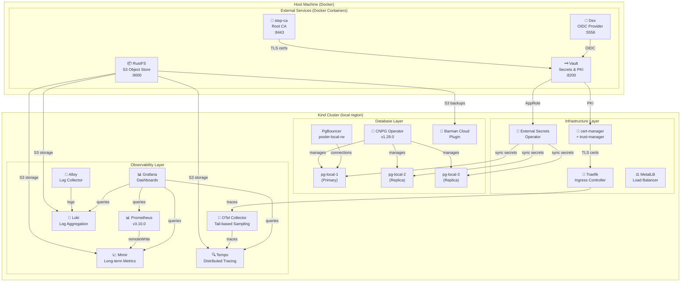
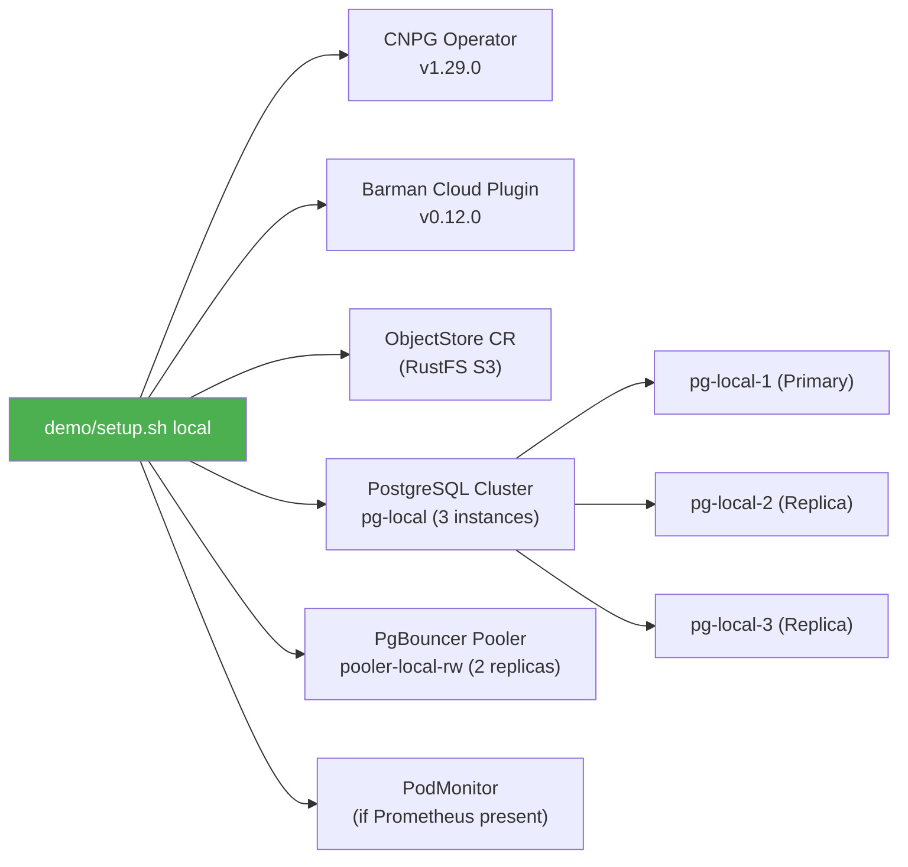
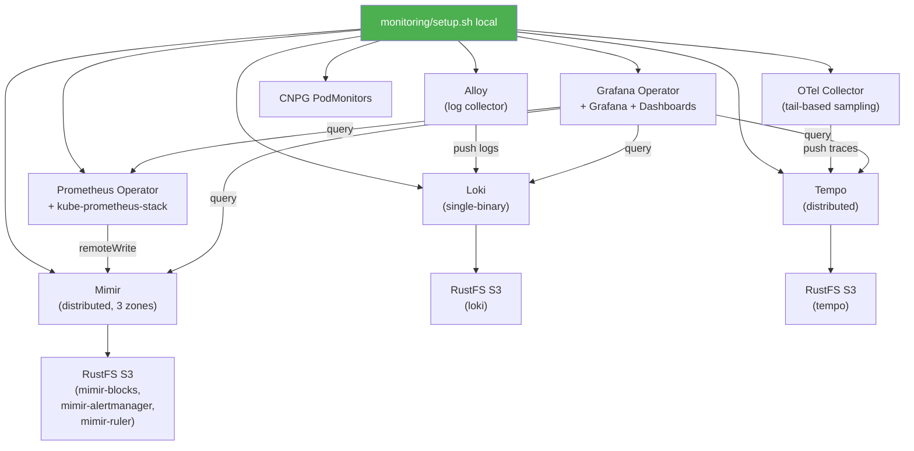
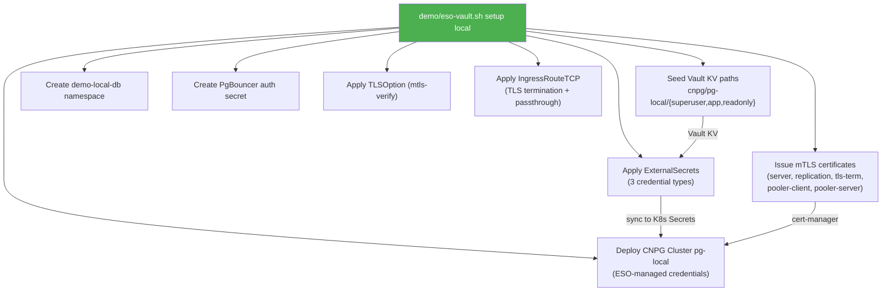
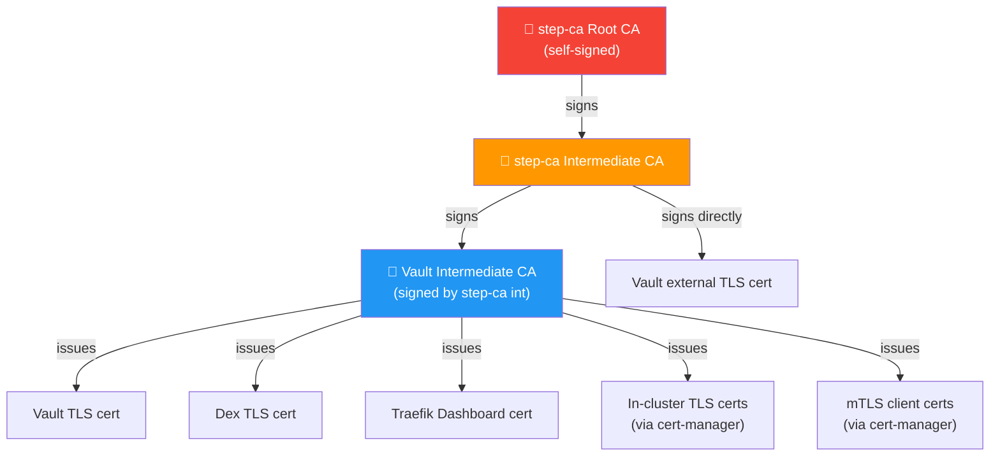
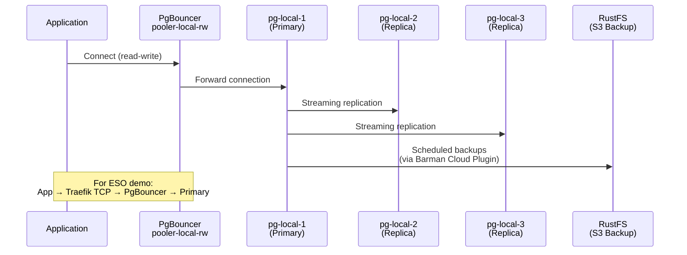
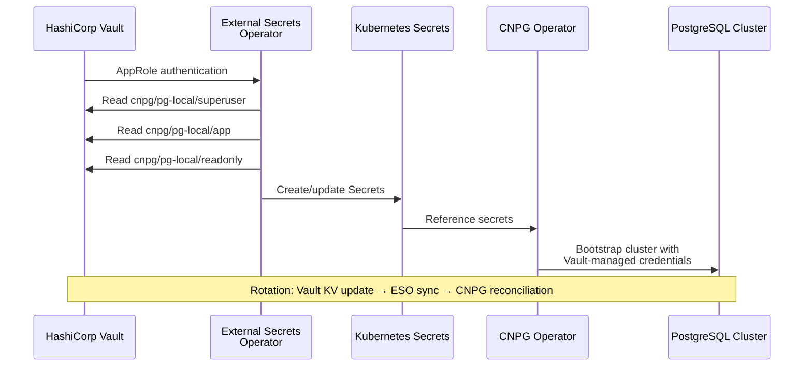
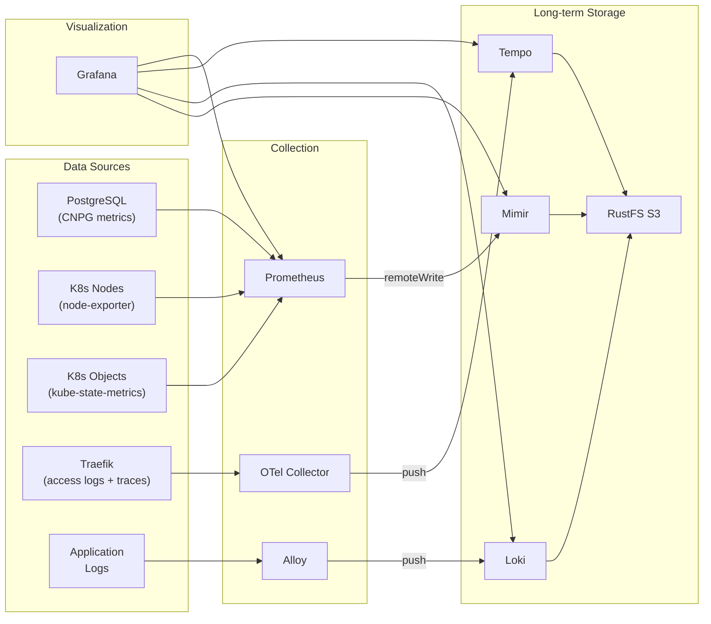

# CNPG Playground — Architecture Overview

> A local learning environment for **CloudNativePG** (CNPG), the PostgreSQL operator for Kubernetes.

---

## 1. What Is This Project?

CNPG Playground creates a **fully functional Kubernetes-based PostgreSQL platform** on your laptop using Docker/Kind. It simulates production-grade infrastructure — including TLS certificate management, secrets management, observability, and distributed database topologies — so teams can learn, experiment, and validate CNPG patterns without needing a cloud environment.

---

## 2. High-Level System Diagram

---

## 3. Setup Scripts — What Each One Does

### 3.1 `scripts/setup.sh local` — Infrastructure Bootstrap

This is the **foundation script** that creates everything the other scripts depend on.

```mermaid
flowchart TD
    A["scripts/setup.sh local"] --> P0["Phase 0: External Services"]
    P0 --> P0A["step-ca (Root CA)"]
    P0 --> P0B["Vault (Secrets + PKI)"]
    P0 --> P0C["Vault PKI Setup"]
    P0 --> P0D["Vault ESO AppRole"]
    P0 --> P0E["Dex (OIDC)"]

    A --> P1["Phase 1: Cluster Provisioning"]
    P1 --> P1A["Kind Cluster Creation<br/>(7 nodes: 1 control-plane + 6 workers)"]
    P1 --> P1B["RustFS S3 Container"]
    P1 --> P1C["MetalLB (Load Balancer)"]
    P1 --> P1D["cert-manager + trust-manager"]
    P1 --> P1E["External Secrets Operator"]
    P1 --> P1F["Traefik Ingress Controller"]
    P1 --> P1G["Wire step-ca & Vault<br/>into K8s via Services/Endpoints"]

    A --> P2["Phase 2: Secret Distribution"]
    P2 --> P2A["RustFS credentials<br/>to all clusters"]

    A --> P3["Post-Loop Configuration"]
    P3 --> P3A["Vault OIDC auth"]
    P3 --> P3B["step-ca OIDC provisioner"]

    style A fill:#4CAF50,color:white
    style P0 fill:#2196F3,color:white
    style P1 fill:#FF9800,color:white
    style P2 fill:#9C27B0,color:white
    style P3 fill:#F44336,color:white
```

**Key outcomes:**
- A 7-node Kind cluster with labeled node pools (control-plane, infra, app, postgres)
- External services (step-ca, Vault, Dex, RustFS) running as Docker containers, wired into K8s via headless Services/Endpoints
- Full 3-tier PKI: step-ca Root → step-ca Intermediate → Vault Intermediate → leaf certs
- cert-manager ClusterIssuer for Vault PKI, trust-manager distributing CA bundles
- ESO ClusterSecretStore with Vault AppRole authentication
- Traefik with MetalLB LoadBalancer, TLS dashboard, and PostgreSQL TCP routing

### 3.2 `demo/setup.sh local` — Database Deployment

**Key outcomes:**
- CNPG operator managing a 3-instance PostgreSQL 18 cluster (1 primary + 2 replicas)
- PgBouncer connection pooler for read-write traffic
- Scheduled backups to RustFS via Barman Cloud Plugin
- PodMonitor for Prometheus metrics collection

### 3.3 `monitoring/setup.sh local` — Observability Stack

**Key outcomes:**
- Full observability stack: metrics (Prometheus → Mimir), logs (Alloy → Loki), traces (OTel → Tempo)
- Grafana with 5 datasources and 10 pre-configured dashboards
- All long-term storage backed by RustFS S3
- Hub-and-spoke architecture (hub region runs Mimir + Tempo; spokes push via Traefik IngressRoutes)

### 3.4 `demo/eso-vault.sh setup local` — Secrets Management Demo

**Key outcomes:**
- PostgreSQL credentials (superuser, app, readonly) managed by Vault and synced to K8s via ESO
- Full mTLS infrastructure: server, replication, and client certificates issued by cert-manager via Vault PKI
- Two PostgreSQL access patterns via Traefik:
  - **TLS termination**: `pg-local-demo-local-db-t.<IP>.sslip.io:5432`
  - **TLS passthrough**: `pg-local-demo-local-db-p.<IP>.sslip.io:5432`
- Credential rotation workflow: update in Vault → force ESO sync → CNPG reconciles

---

## 4. PKI Trust Chain

**How it works:**
1. **step-ca** is the trust anchor — its root certificate is distributed to all namespaces via trust-manager
2. **Vault** runs its own PKI intermediate, signed by step-ca's intermediate
3. **cert-manager** uses Vault's PKI backend (via AppRole auth) to issue in-cluster leaf certificates
4. All TLS-serving endpoints include the full chain (leaf + intermediates + root) for verification without out-of-band CA distribution

---

## 5. Data Flow Diagrams

### 5.1 PostgreSQL Connection Flow

### 5.2 Secrets Management Flow (ESO Demo)

### 5.3 Observability Data Flow

---

## 6. Current Cluster State (Live)

### Nodes (7 total)

| Node | Role | Labels |
|------|------|--------|
| k8s-local-control-plane | control-plane | `node-role.kubernetes.io/control-plane` |
| k8s-local-worker | worker | `node-role.kubernetes.io/infra`, `node-role.kubernetes.io/app` |
| k8s-local-worker2 | worker | `node-role.kubernetes.io/app` |
| k8s-local-worker3 | worker | `node-role.kubernetes.io/app` |
| k8s-local-worker4 | worker | `node-role.kubernetes.io/postgres` |
| k8s-local-worker5 | worker | `node-role.kubernetes.io/postgres` |
| k8s-local-worker6 | worker | `node-role.kubernetes.io/postgres` |

### Namespaces (18)

| Namespace | Purpose |
|-----------|---------|
| cert-manager | cert-manager + trust-manager (TLS/PKI) |
| cnpg-system | CNPG operator + Barman Cloud Plugin |
| default | pg-local cluster (basic demo) |
| demo-local-db | pg-local cluster (ESO/Vault demo) |
| external-secrets | External Secrets Operator |
| grafana | Grafana Operator, Grafana, Loki, Alloy |
| metallb-system | MetalLB load balancer |
| mimir | Mimir (long-term metrics) |
| otel | OTel Collector |
| prometheus-operator | Prometheus Operator + kube-prometheus-stack |
| step-ca | step-ca service wiring |
| tempo | Tempo (distributed tracing) |
| traefik | Traefik v3 ingress controller |
| vault | Vault service wiring |

### PostgreSQL Clusters (2)

| Namespace | Cluster | Instances | Primary | Pooler | Credentials |
|-----------|---------|-----------|---------|--------|-------------|
| default | pg-local | 3 (1P + 2R) | pg-local-1 | pooler-local-rw (2 replicas) | CNPG-managed |
| demo-local-db | pg-local | 3 (1P + 2R) | pg-local-1 | pooler-local-rw (2 replicas) | Vault-managed via ESO |

### Key Services (LoadBalancer)

| Service | External IP | Ports |
|---------|-------------|-------|
| traefik | 172.18.255.200 | 80, 443 |
| traefik-postgres | 172.18.255.210 | 5432 |

---

## 7. Component Inventory

### Helm Releases

| Release | Namespace | Chart | App Version |
|---------|-----------|-------|-------------|
| alloy | grafana | alloy-1.8.0 | v1.16.0 |
| barman-cloud | cnpg-system | plugin-barman-cloud-0.6.0 | v0.12.0 |
| cert-manager | cert-manager | cert-manager-v1.20.2 | v1.20.2 |
| cnpg-operator | cnpg-system | cloudnative-pg-0.28.0 | 1.29.0 |
| external-secrets | external-secrets | external-secrets-2.4.1 | v2.4.1 |
| grafana-operator | grafana | grafana-operator-5.22.2 | v5.22.2 |
| kube-prometheus-stack | prometheus-operator | kube-prometheus-stack-83.6.0 | v0.90.1 |
| loki | grafana | loki-13.5.0 | 3.7.1 |
| metallb | metallb-system | metallb-0.15.3 | v0.15.3 |
| mimir | mimir | mimir-distributed-5.7.0 | 2.16.0 |
| otel-collector | otel | opentelemetry-collector-0.153.0 | 0.151.0 |
| tempo | tempo | tempo-distributed-2.19.0 | 2.10.5 |
| traefik | traefik | traefik-39.0.8 | v3.6.13 |
| trust-manager | cert-manager | trust-manager-v0.17.1 | v0.17.1 |

### External Docker Containers

| Container | Port | Purpose |
|-----------|------|---------|
| step-ca | 8443 | Root CA + Intermediate CA |
| Vault | 8200 | Secrets management, PKI, AppRole auth |
| Dex | 5556 | OIDC identity provider |
| RustFS | 9000 | S3-compatible object storage |

### Grafana Dashboards

| Dashboard | Purpose |
|-----------|---------|
| cloudnativepg-dashboard | CNPG cluster overview |
| cnpg-custom-pg | Custom PostgreSQL metrics |
| k8s-events | Kubernetes events |
| k8s-pod-logs | Pod log viewer |
| k8s-resources-cluster | Cluster resource overview |
| k8s-views-global | Global cluster views |
| k8s-views-pods | Pod detail views |
| node-exporter-full | Node metrics |
| pgaudit-dashboard | PGAudit logging |
| traefik-traces | Traefik request tracing |