# CNPG Playground — Architecture Overview

> A local learning environment for **CloudNativePG** (CNPG), the PostgreSQL operator for Kubernetes.
>
> For a component-by-component deep dive — every Docker container, every cluster layer, and
> the exact container↔cluster wiring — see [`detailed-architecture.md`](detailed-architecture.md).

---

## 1. What Is This Project?

CNPG Playground creates a **fully functional Kubernetes-based PostgreSQL platform** on your laptop using Docker/Kind. It simulates production-grade infrastructure — including TLS certificate management, secrets management, observability, and distributed database topologies — so teams can learn, experiment, and validate CNPG patterns without needing a cloud environment.

---

## 2. High-Level System Diagram

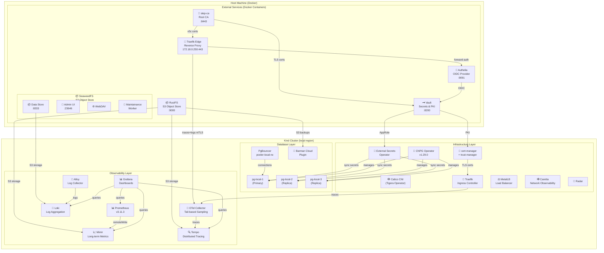

---

## 2.1 How the Docker Containers Link to the Cluster

The external services run as **Docker containers**, not as pods. Both the containers and
the Kind nodes are attached to the **same `kind` Docker bridge** (`172.18.0.0/16`), so
they share an L3 network. On top of that shared network the project uses **three distinct
wiring mechanisms** to connect the two worlds — this is the "link" between containers and
cluster:

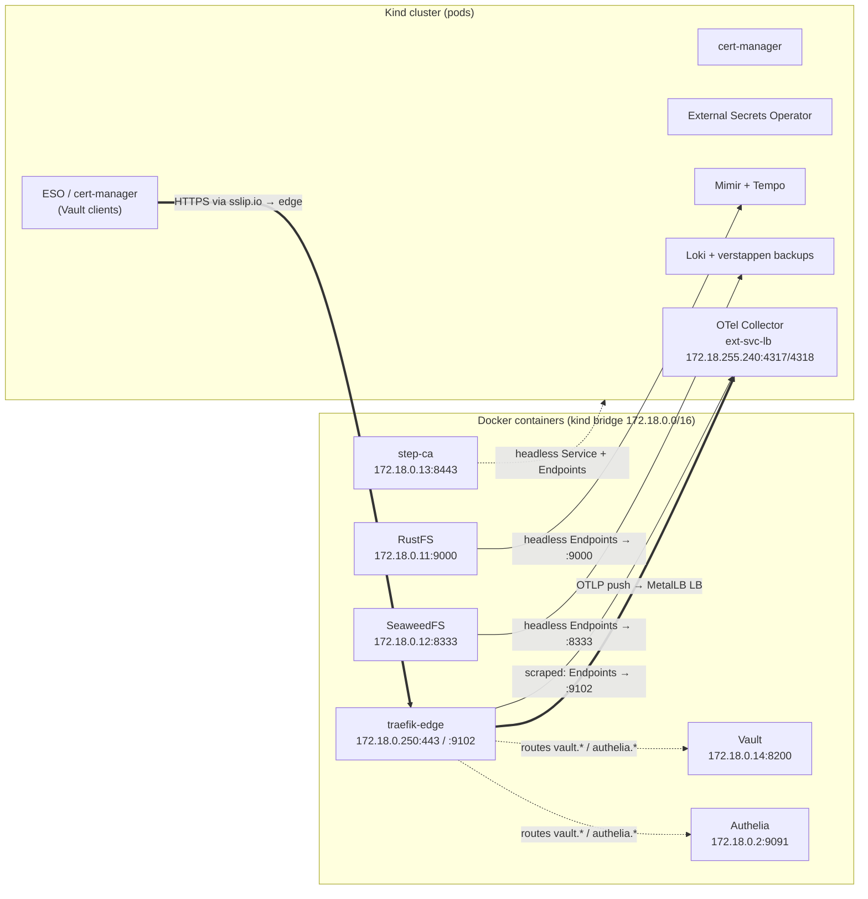

| Mechanism | Containers reached this way | Cluster side | How it resolves |
|---|---|---|---|
| **1. Direct headless `Service` + manual `Endpoints`** | step-ca, RustFS (`objectstore-local`), SeaweedFS | `step-ca/step-ca`, `mimir,tempo/objectstore-local`, `grafana,rbr-ver-db/seaweedfs` | In-cluster DNS name resolves to the container's **kind-bridge IP**; pods dial it directly on the shared bridge. |
| **2. Via the `traefik-edge` proxy** (`*.172-18-0-250.sslip.io`) | Vault, Authelia | ESO `ClusterSecretStore` (`vault-approle*`) + cert-manager `ClusterIssuer` (`vault-pki`) → `https://vault.172-18-0-250.sslip.io`; Authelia `ExternalName` → `authelia.172-18-0-250.sslip.io` | The `sslip.io` hostname resolves to `172.18.0.250` (the **edge container**), which TLS-terminates and routes to the backend container. There is **no** in-cluster `vault` Service. |
| **3. Reverse: cluster ← edge** | traefik-edge → cluster | MetalLB `LoadBalancer` `otel/ext-svc-lb` at `172.18.255.240:4317/4318` | The edge container pushes **OTLP traces + logs** into the cluster over the MetalLB VIP; the cluster in turn **scrapes** the edge's Prometheus metrics at `172.18.0.250:9102`. |

**Why two different mechanisms?** Data-plane dependencies that need raw TCP and no auth
edge (S3 object storage, the step-ca ACME/JWK endpoint) get **direct headless Endpoints**.
Security-sensitive HTTP services that must be TLS-terminated and (for human traffic)
forward-authed are fronted by the **edge proxy** under stable `sslip.io` hostnames, so the
same URL works from inside the cluster, from other containers, and from the host browser.

---

## 3. Setup Scripts — What Each One Does

### 3.1 `scripts/setup.sh local` — Infrastructure Bootstrap

This is the **foundation script** that creates everything the other scripts depend on.

```mermaid
flowchart TD
    A["scripts/setup.sh local"] --> P0["Phase 0: External Services"]
    P0 --> P0A["step-ca (Root CA)"]
    P0 --> P0B["Vault (Secrets + PKI)"]
    P0 --> P0C["Vault PKI Setup"]
    P0 --> P0D["Vault ESO AppRole"]
    P0 --> P0E["Authelia (OIDC)"]

    A --> P1["Phase 1: Cluster Provisioning"]
    P1 --> P1A["Kind Cluster Creation<br/>(8 nodes: 1 control-plane + 7 workers:<br/>2 infra + 2 app + 3 postgres)"]
    P1 --> P1A2["Calico CNI<br/>(Tigera Operator)"]
    P1 --> P1B["RustFS S3 Container"]
    P1 --> P1B2["SeaweedFS S3 Container"]
    P1 --> P1C["MetalLB (Load Balancer)"]
    P1 --> P1D["cert-manager + trust-manager"]
    P1 --> P1E["External Secrets Operator"]
    P1 --> P1F["Traefik Ingress Controller"]
    P1 --> P1G["Wire step-ca & Vault<br/>into K8s via Services/Endpoints"]
    P1 --> P1H["Caretta + Radar<br/>(network observability)"]

    A --> P2["Phase 2: Secret Distribution"]
    P2 --> P2A["RustFS credentials<br/>to all clusters"]
    P2 --> P2A2["SeaweedFS credentials<br/>to all clusters"]

    A --> P3["Post-Loop Configuration"]
    P3 --> P3A["Vault OIDC auth"]
    P3 --> P3B["step-ca OIDC provisioner"]

    A --> P4["Phase 4: Platform Governance Layer"]
    P4 --> P4A["Capsule + capsule-proxy<br/>(multi-tenancy)"]
    P4 --> P4B["Kyverno (policy engine)"]
    P4 --> P4C["ArgoCD (GitOps)"]
    P4 --> P4D["gangplank (OIDC→kubeconfig)"]

    style A fill:#4CAF50,color:white
    style P0 fill:#2196F3,color:white
    style P1 fill:#FF9800,color:white
    style P2 fill:#9C27B0,color:white
    style P3 fill:#F44336,color:white
    style P4 fill:#607D8B,color:white
```

**Key outcomes:**
- An 8-node Kind cluster with labeled node pools: control-plane, **2 infra**, **2 app** (untainted, nodeSelector-only), **3 postgres** (tainted `NoSchedule`)
- External services (step-ca, Vault, Authelia, RustFS) running as Docker containers, wired into K8s via headless Services/Endpoints
- Calico CNI (via Tigera Operator) providing pod networking, with Caretta + Radar for network observability
- Full 3-tier PKI: step-ca Root → step-ca Intermediate → Vault Intermediate → leaf certs
- cert-manager ClusterIssuer for Vault PKI, trust-manager distributing CA bundles
- ESO ClusterSecretStore with Vault AppRole authentication
- Traefik with MetalLB LoadBalancer, TLS dashboard, and PostgreSQL TCP routing
- **Platform governance layer:** Capsule + capsule-proxy (multi-tenancy), Kyverno (policy), ArgoCD (GitOps), gangplank (OIDC→kubeconfig) — the cluster is **ready for tenant onboarding but fully usable without any tenant**. No concrete tenant (`rbr`/`ver`) is created here; that lives in `demo/self-service-setup.sh` (see §8).
- **Opt-in one-shot:** `scripts/setup.sh local --with-tenant` chains `monitoring/setup.sh local` then `demo/self-service-setup.sh setup local` for the full demo.

### 3.2 `demo/setup.sh local` — Database Deployment

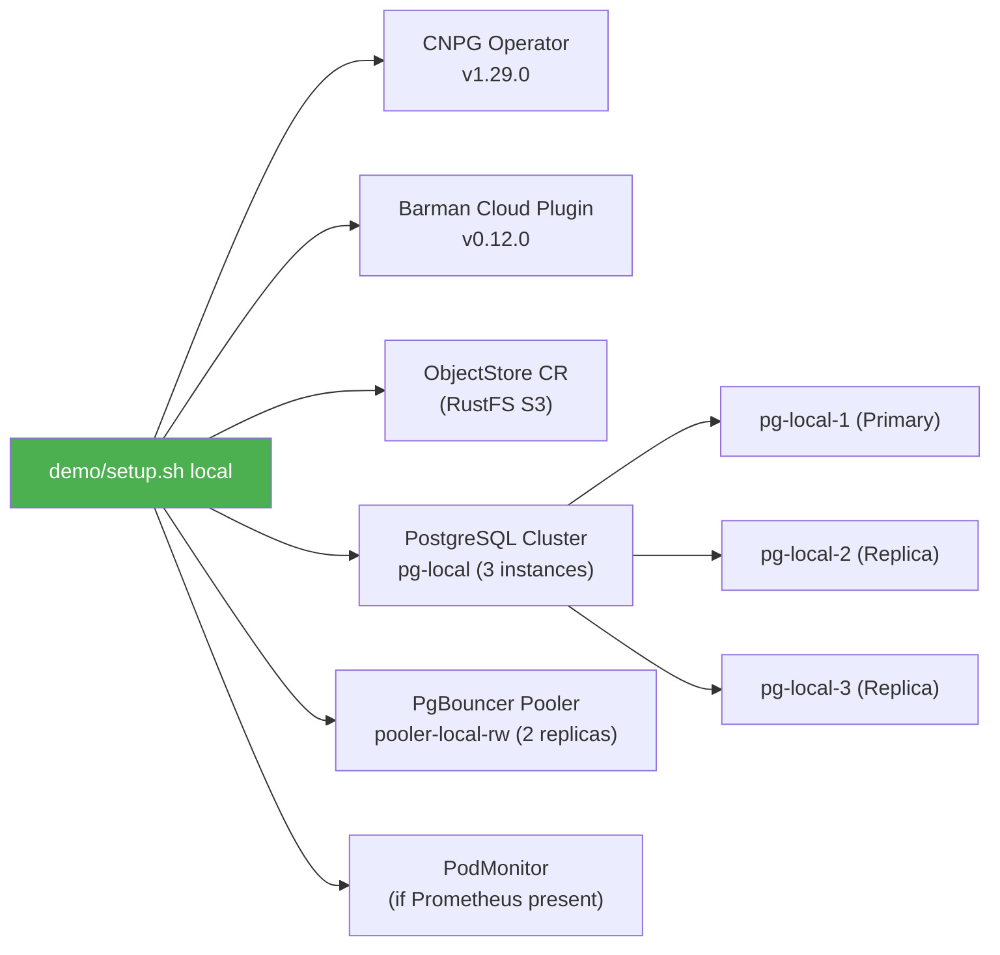

**Key outcomes:**
- CNPG operator managing a 3-instance PostgreSQL 18 cluster (1 primary + 2 replicas)
- PgBouncer connection pooler for read-write traffic
- Scheduled backups to RustFS via Barman Cloud Plugin
- PodMonitor for Prometheus metrics collection

### 3.3 `monitoring/setup.sh local` — Observability Stack

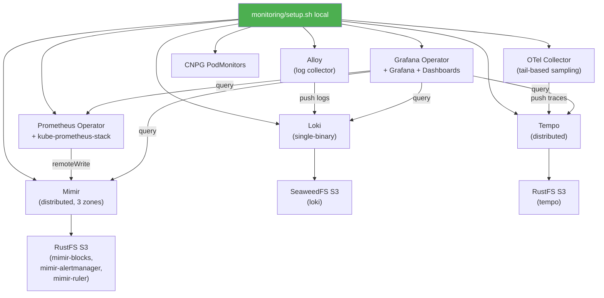

**Key outcomes:**
- Full observability stack: metrics (Prometheus → Mimir), logs (Alloy → Loki), traces (OTel → Tempo)
- Grafana with 5 datasources (Prometheus [default], Mimir, Mimir-Tempo, Loki, Tempo) and 12 pre-configured dashboards
- All long-term storage backed by RustFS S3
- Hub-and-spoke architecture (hub region runs Mimir + Tempo; spokes push via Traefik IngressRoutes)

### 3.4 `demo/eso-vault.sh setup local` — Secrets Management Demo

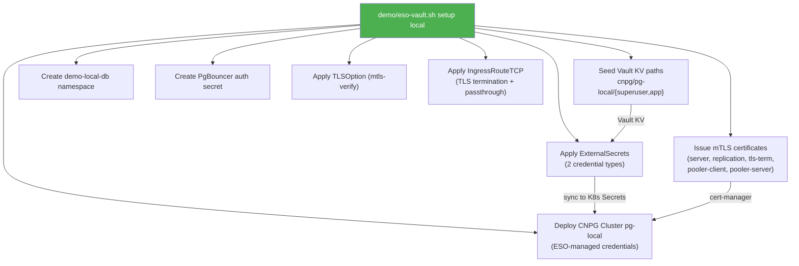

**Key outcomes:**
- PostgreSQL credentials (superuser, app) managed by Vault and synced to K8s via ESO
- Full mTLS infrastructure: server, replication, and client certificates issued by cert-manager via Vault PKI
- Two PostgreSQL access patterns via Traefik:
  - **TLS termination**: `pg-local-demo-local-db-t.<IP>.sslip.io:5432`
  - **TLS passthrough**: `pg-local-demo-local-db-p.<IP>.sslip.io:5432`
- Credential rotation workflow: update in Vault → force ESO sync → CNPG reconciles

---

## 4. PKI Trust Chain

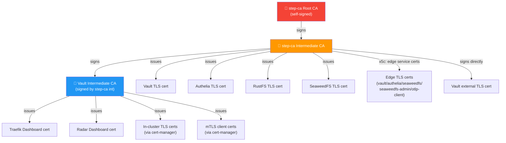

**How it works:**
1. **step-ca** is the trust anchor — its root certificate is distributed to all namespaces via trust-manager
2. **Vault** runs its own PKI intermediate, signed by step-ca's intermediate
3. **cert-manager** uses Vault's PKI backend (via AppRole auth) to issue in-cluster leaf certificates
4. All TLS-serving endpoints include the full chain (leaf + intermediates + root) for verification without out-of-band CA distribution

---

## 5. Data Flow Diagrams

### 5.1 PostgreSQL Connection Flow

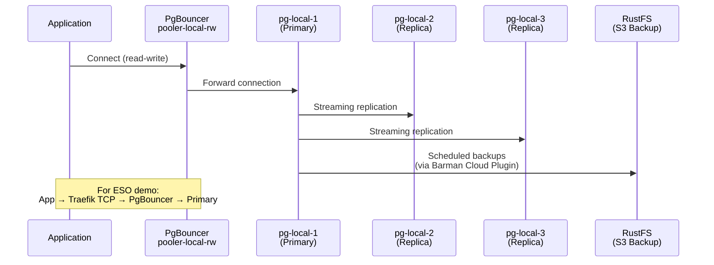

### 5.2 Secrets Management Flow (ESO Demo)

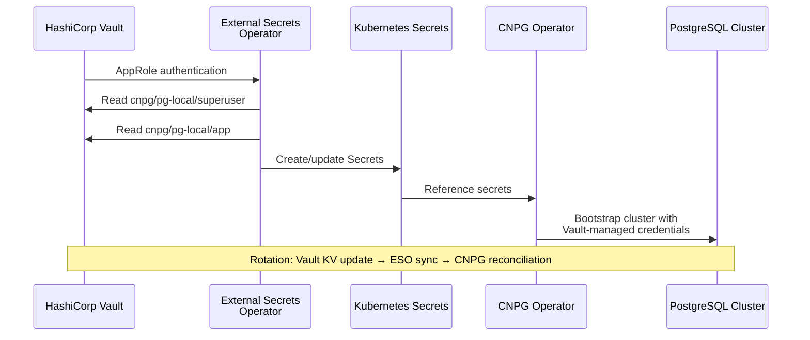

### 5.3 Observability Data Flow

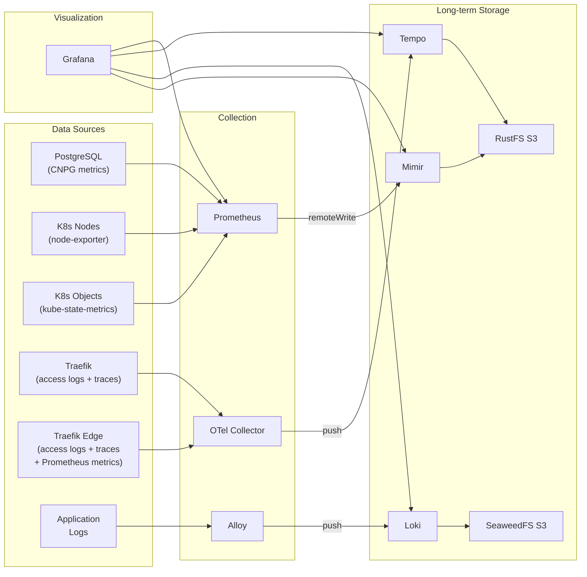

---

## 6. Current Cluster State (Live)

### Nodes (8 total)

| Node | Role | Labels |
|------|------|--------|
| k8s-local-control-plane | control-plane | `node-role.kubernetes.io/control-plane` |
| k8s-local-worker | worker | `node-role.kubernetes.io/infra` |
| k8s-local-worker2 | worker | `node-role.kubernetes.io/infra` |
| k8s-local-worker3 | worker | `node-role.kubernetes.io/app` (untainted) |
| k8s-local-worker4 | worker | `node-role.kubernetes.io/app` (untainted) |
| k8s-local-worker5 | worker | `node-role.kubernetes.io/postgres` (taint `NoSchedule`) |
| k8s-local-worker6 | worker | `node-role.kubernetes.io/postgres` (taint `NoSchedule`) |
| k8s-local-worker7 | worker | `node-role.kubernetes.io/postgres` (taint `NoSchedule`) |

### Application & Infrastructure Namespaces (25)

> Snapshot of a `scripts/setup.sh local --with-tenant` install (platform **and** tenant present).
> Excludes Kubernetes system namespaces (`kube-system`, `kube-public`, `kube-node-lease`, `local-path-storage`) and the unused `default` namespace. `kubelet-csr-approver` and `metrics-server` add-ons run in `kube-system` / `metrics-server`.

| Namespace | Purpose |
|-----------|---------|
| argocd | ArgoCD GitOps engine (tenant app-of-apps) |
| authelia | Authelia OIDC provider service wiring (`ExternalName` → edge) |
| calico-system | Calico CNI (node, typha, kube-controllers, apiserver, whisker) |
| capsule-system | Capsule + capsule-proxy (multi-tenancy) |
| caretta | Caretta network observability |
| cert-manager | cert-manager + trust-manager (TLS/PKI) |
| cnpg-system | CNPG operator + Barman Cloud Plugin |
| external-secrets | External Secrets Operator |
| gangplank | gangplank (OIDC → kubeconfig dispenser) |
| grafana | Grafana Operator, platform Grafana, tenant Grafana, Loki, Alloy |
| kyverno | Kyverno policy engine + kyverno-policies |
| metallb-system | MetalLB load balancer |
| metrics-server | Kubernetes metrics-server |
| mimir | Mimir (long-term metrics) + RustFS S3 wiring |
| otel | OTel Collector (+ `ext-svc-lb` OTLP LoadBalancer) |
| pgadmin | pgAdmin for the tenant `verstappen` database |
| policy-reporter | Policy Reporter (Kyverno results UI) |
| prometheus-operator | Prometheus Operator + kube-prometheus-stack |
| radar | Radar network observability UI |
| rbr-ver | Tenant app namespace: `demo-app` (Litestar) |
| rbr-ver-db | Tenant DB namespace: `verstappen` CNPG + SeaweedFS wiring |
| step-ca | step-ca service wiring (headless Endpoints) |
| tempo | Tempo (distributed tracing) + RustFS S3 wiring |
| tigera-operator | Tigera Operator (manages Calico) |
| traefik | Traefik v3 ingress controller |

> Note: there is **no** `vault` namespace — Vault is reached through the edge proxy at
> `vault.172-18-0-250.sslip.io` (see §2.1), not via an in-cluster Service.

### PostgreSQL Clusters (1)

| Namespace | Cluster | Instances | Primary | Pooler | Credentials | Backups |
|-----------|---------|-----------|---------|--------|-------------|---------|
| rbr-ver-db | verstappen | 3 (1P + 2R) | verstappen-1 | pooler-verstappen-rw (2 replicas, on app nodes) | Vault DB engine static role via ESO | SeaweedFS S3 (Barman Cloud Plugin) |

> The legacy `demo/setup.sh` / `demo/eso-vault.sh` `pg-local` cluster (in `demo-local-db`,
> backed by RustFS) is **not** deployed in the `--with-tenant` flow; the live database is
> the self-service tenant cluster `verstappen`.

### Tenant & Governance (live)

| Object | Namespace | State |
|--------|-----------|-------|
| Capsule `Tenant rbr` | cluster-scoped | Active (owns `rbr-ver`, `rbr-ver-db`) |
| ArgoCD `rbr-root` (app-of-apps) | argocd | Synced / Healthy |
| ArgoCD `tenant-rbr` | argocd | Synced / Healthy |
| ArgoCD `kyverno-policies` | argocd | Synced / Healthy |
| ArgoCD `grafana-rbr-ver` | argocd | Synced / Healthy |
| ArgoCD `demo-app` | argocd | Synced |
| `demo-app` (Litestar) | rbr-ver | Deployment (app nodes) |
| `pgadmin-rbr-ver` | pgadmin | Deployment |
| Tenant Grafana `grafana-rbr-ver` | grafana | reconciled by Grafana Operator |

### Key Services (LoadBalancer)

| Service | External IP | Ports | Purpose |
|---------|-------------|-------|---------|
| traefik | 172.18.255.200 | 80, 443 | HTTP/HTTPS ingress |
| traefik-postgres | 172.18.255.210 | 5432 | PostgreSQL TCP ingress |
| otel / ext-svc-lb | 172.18.255.240 | 4317, 4318 | OTLP intake from the edge container (traces + logs) |

---

## 7. Component Inventory

### Helm Releases

> Live snapshot (26 releases) from a `--with-tenant` install.

| Release | Namespace | Chart | App Version |
|---------|-----------|-------|-------------|
| alloy | grafana | alloy-1.8.0 | v1.16.0 |
| argocd | argocd | argo-cd-9.7.0 | v3.4.4 |
| barman-cloud | cnpg-system | plugin-barman-cloud-0.6.0 | v0.12.0 |
| capsule | capsule-system | capsule-0.13.6 | 0.13.6 |
| capsule-proxy | capsule-system | capsule-proxy-0.13.5 | 0.13.5 |
| caretta | caretta | caretta-0.0.16 | v0.0.16 |
| cert-manager | cert-manager | cert-manager-v1.20.2 | v1.20.2 |
| cnpg-operator | cnpg-system | cloudnative-pg-0.28.0 | 1.29.0 |
| external-secrets | external-secrets | external-secrets-2.4.1 | v2.4.1 |
| gangplank | gangplank | gangplank-0.2.1 | 1.1.0 |
| grafana-operator | grafana | grafana-operator-5.22.2 | v5.22.2 |
| kube-prometheus-stack | prometheus-operator | kube-prometheus-stack-86.2.3 | v0.91.0 |
| kubelet-csr-approver | kube-system | kubelet-csr-approver-1.2.14 | v1.2.14 |
| kyverno | kyverno | kyverno-3.8.1 | v1.18.1 |
| kyverno-policies | kyverno | kyverno-policies-3.8.1 | v1.18.1 |
| loki | grafana | loki-13.5.0 | 3.7.1 |
| metallb | metallb-system | metallb-0.16.1 | v0.16.1 |
| metrics-server | metrics-server | metrics-server-3.13.1 | 0.8.1 |
| mimir | mimir | mimir-distributed-6.0.6 | 3.0.4 |
| otel-collector | otel | opentelemetry-collector-0.158.2 | 0.153.0 |
| policy-reporter | policy-reporter | policy-reporter-3.7.4 | 3.7.4 |
| radar | radar | radar-1.7.9 | 1.7.9 |
| tempo | tempo | tempo-distributed-2.25.2 | 2.10.7 |
| tigera-operator | tigera-operator | tigera-operator-v3.32.0 | v3.32.0 |
| traefik | traefik | traefik-41.0.1 | v3.7.5 |
| trust-manager | cert-manager | trust-manager-v0.17.1 | v0.17.1 |

### External Docker Containers

All external containers share the **`kind` Docker bridge** (`172.18.0.0/16`) with the cluster
nodes; the "IP (kind)" column is the address the cluster wires to (see §2.1). Host-published
ports are what you reach from the laptop.

| Container | Image | IP (kind) | Container port | Host port | Purpose |
|-----------|-------|-----------|----------------|-----------|---------|
| step-ca | smallstep/step-ca:latest | 172.18.0.13 | 8443 | 8443 | Root CA + Intermediate CA |
| vault | hashicorp/vault:2.0 | 172.18.0.14 | 8200 (+8202 cluster) | 8200 | Secrets management, PKI, AppRole + DB engine |
| authelia | ghcr.io/authelia/authelia:4.39.20 | 172.18.0.2 | 9091 | 9091 | OIDC identity provider (replaces Dex) |
| objectstore-local (RustFS) | rustfs/rustfs:latest | 172.18.0.11 | 9000 | 9001 | S3 object storage (Mimir, Tempo) |
| seaweedfs (SeaweedFS) | chrislusf/seaweedfs:latest | 172.18.0.12 | 8333 (S3) | 8333/8334 | S3 object storage (Loki, tenant backups) |
| seaweedfs-admin | chrislusf/seaweedfs:latest | 172.18.0.15 | 23646 | 23646 | SeaweedFS admin UI |
| seaweedfs-webdav | chrislusf/seaweedfs:latest | — (compose net) | 7333 | 7333 | SeaweedFS WebDAV gateway |
| seaweedfs-worker | chrislusf/seaweedfs:latest | — (compose net) | 9327 | 9327 | SeaweedFS maintenance worker |
| traefik-edge | traefik:v3.7.5 | 172.18.0.250 | 443 / 80 / 9102 | 80/443 | Edge reverse proxy: TLS termination, Authelia forward-auth, `*.sslip.io` routing, OTLP traces/logs export, Prometheus metrics on :9102 |
| revocation-exporter | revocation-exporter:latest | (host net) | — | — | step-ca CRL / certificate revocation metrics exporter |

### Grafana Dashboards

| Dashboard | Purpose |
|-----------|---------|
| argocd | Argo CD controllers / sync metrics |
| calico-felix | Calico data-plane (Felix) metrics |
| capsule-resourcepools | Capsule tenant resource pool usage |
| kyverno | Kyverno policy / admission metrics |
| cloudnativepg-dashboard | CNPG cluster overview |
| cnpg-backup-dashboard | CNPG backup status |
| cnpg-custom-pg | Custom PostgreSQL metrics |
| k8s-events | Kubernetes events |
| k8s-pod-logs | Pod log viewer |
| k8s-resources-cluster | Cluster resource overview |
| k8s-views-global | Global cluster views |
| k8s-views-pods | Pod detail views |
| node-exporter-full | Node metrics |
| pgaudit-dashboard | PGAudit logging |
| pki-dashboard | PKI / certificate health |
| traefik-traces | Traefik request tracing |

---

## 8. Self-Service Tenancy

> **Status: deployed (live).** This snapshot was taken with `scripts/setup.sh local --with-tenant`,
> which runs `demo/self-service-setup.sh` — so the tenant `rbr` (namespaces `rbr-ver` / `rbr-ver-db`,
> the `verstappen` CNPG cluster, `demo-app`, pgAdmin, and tenant Grafana) **is present** in the
> "Current Cluster State (Live)" inventory above. On a plain `scripts/setup.sh local` (no
> `--with-tenant`) the platform layer is installed but these tenant objects are absent. Master plan:
> [`plan-self-service-setup-local.md`](plan-self-service-setup-local.md). Identity model:
> [`plan-tenant-personas-authelia.md`](plan-tenant-personas-authelia.md).

The self-service slice turns the demo into a Kubernetes-native multi-tenant platform: tenants
self-provision a CNPG database (`verstappen` in `rbr-ver-db`) and run the `demo-app` (in `rbr-ver`),
governed by Capsule, Kyverno, and ArgoCD, with Authelia OIDC across every surface.

Tenant model: constructor `rbr` (= Capsule Tenant) → driver group `ver` → namespaces `rbr-ver-db`
(database) + `rbr-ver` (app). Future driver groups (`rbr-had`, …) join the same Tenant.

### Onboarding boundary & run order

The **platform governance layer** (Capsule, capsule-proxy, Kyverno, ArgoCD, gangplank) is installed
by `scripts/setup.sh` (§3.1) and is always present on a fresh cluster. The **concrete tenant instance**
(`Tenant rbr`, namespaces `rbr-ver`/`rbr-ver-db`, the `verstappen` CNPG cluster, the ArgoCD app-of-apps,
`demo-app`, pgAdmin, and the tenant Grafana) is owned exclusively by `demo/self-service-setup.sh`. A
default `scripts/setup.sh local` leaves **zero** tenant resources behind.

Canonical run order:

1. `scripts/setup.sh local` — cluster + platform (no tenant).
2. `monitoring/setup.sh local` — observability stack. **Hard requirement:** `demo/self-service-setup.sh`
   preflights for the `grafana` namespace and the Grafana operator CRD and **fails fast** if monitoring
   is absent, because the tenant Grafana depends on it.
3. `demo/self-service-setup.sh setup local` — tenant onboarding, in dependency order: Tenant pre-seed →
   tenant namespaces (Capsule-impersonated create) → Vault DB engine + static role → `verstappen`
   cluster → **demo-app build + ArgoCD app-of-apps (last, after the DB + `verstappen-app` secret exist,
   so `demo-app` comes up healthy instead of crash-looping)** → pgAdmin → tenant Grafana.

One-shot equivalent: `scripts/setup.sh local --with-tenant` chains steps 1–3.

App-tier workloads (`demo-app` + the `pooler-verstappen-rw` PgBouncer replicas) are pinned via
`nodeSelector: node-role.kubernetes.io/app: ""` to the 2 untainted **app** nodes; postgres instances
stay on the tainted **postgres** nodes.

Teardown: `demo/self-service-setup.sh teardown local` removes the tenant instance (app-of-apps +
AppProject first, `Tenant rbr` last) but **leaves the platform intact**. Only `scripts/teardown.sh`
nukes the whole cluster.

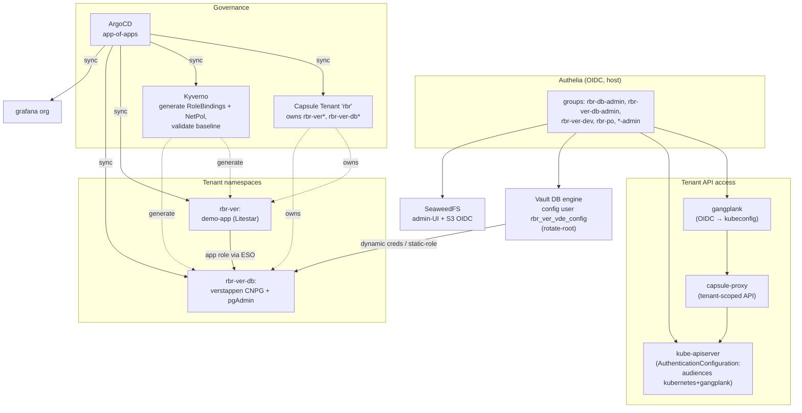

### Components

Platform components are installed by `scripts/setup.sh` (present on every cluster); tenant
components are created by `demo/self-service-setup.sh` (only when onboarding runs).

| Component | Namespace / Host | Installed by | Role |
|---|---|---|---|
| Capsule | `capsule-system` | `scripts/setup.sh` | multi-tenancy engine (the `Tenant rbr` *instance* is created by self-service) |
| capsule-proxy | `capsule-system` | `scripts/setup.sh` | tenant-scoped K8s API gateway |
| gangplank (`sighupio/gangplank`) | `gangplank` | `scripts/setup.sh` | OIDC → kubeconfig dispenser (fronts capsule-proxy) |
| Kyverno | `kyverno` | `scripts/setup.sh` | generate per-driver-group RoleBindings + default NetworkPolicy; validate baseline |
| ArgoCD | `argocd` | `scripts/setup.sh` | GitOps engine (the app-of-apps *instance* is applied by self-service) |
| `Tenant rbr` + namespaces | `rbr-ver`, `rbr-ver-db` | `demo/self-service-setup.sh` | tenant instance + driver-group namespaces |
| demo-app | `rbr-ver` | `demo/self-service-setup.sh` | Litestar sample app (ArgoCD-deployed, static Vault-rotated DB creds; pinned to app nodes) |
| SeaweedFS OIDC | host | `scripts/setup.sh` | admin-UI + S3 human OIDC (machine keys stay static) |

### Identity → access (summary)

See the full matrix in [`plan-tenant-personas-authelia.md`](plan-tenant-personas-authelia.md).

| Persona | K8s | DB | Grafana |
|---|---|---|---|
| `admin` | tenant owner everywhere | full | Admin |
| `rbr-db-admin` | Tenant `rbr` owner | `rbr-db-admin` creds | rbr/Admin |
| `rbr-ver-db-admin` | admin in `rbr-ver*` | `rbr-ver-db-admin` creds | rbr/Editor |
| `rbr-ver-dev` | edit in `rbr-ver*` | `app`/`readonly` creds | rbr/Editor |
| `rbr-po` | view across `rbr-*` | — | rbr/Viewer |

### Two independent authority layers

K8s API access (Capsule + apiserver OIDC + capsule-proxy) and DB credential issuance (Vault
policies) are configured independently; **Authelia is the common IdP**, and each layer verifies the
`email`/`groups` claims on its own. Monitoring additions: ServiceMonitors + Grafana dashboards for
Capsule, capsule-proxy, Calico (felix/typha/kube-controllers), Kyverno, and ArgoCD.

Related plans: [`capsule-integration-plan.md`](capsule-integration-plan.md),
[`plan-kyverno-policies.md`](plan-kyverno-policies.md),
[`plan-argocd-gitops.md`](plan-argocd-gitops.md),
[`plan-seaweedfs-oidc.md`](plan-seaweedfs-oidc.md),
[`plan-self-service-dynamic-creds-pgadmin.md`](plan-self-service-dynamic-creds-pgadmin.md).