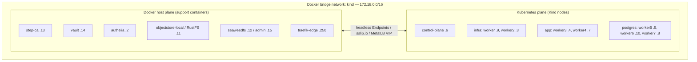
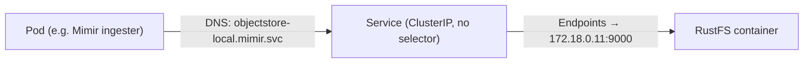
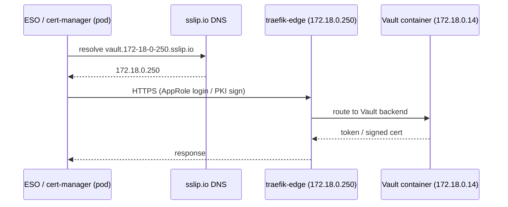
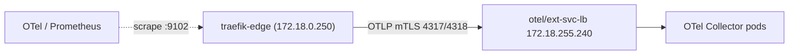
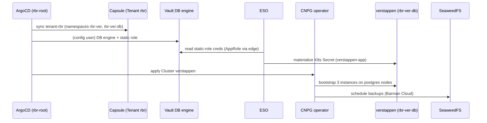

# CNPG Playground — Detailed Architecture

> Deep reference for the two runtime planes — **Docker containers** and the **Kind
> Kubernetes cluster** — every component in each, and exactly how they interact.
> Companion to [`architecture-overview.md`](architecture-overview.md); this document
> reflects a live `scripts/setup.sh local --with-tenant` install.

---

## 1. Two Planes, One Network

The playground runs in two cooperating planes on a single laptop:

| Plane | What runs here | Lifecycle owner |
|-------|----------------|-----------------|
| **Docker host plane** | The trust anchor (step-ca), the secrets/PKI engine (Vault), the IdP (Authelia), two S3 object stores (RustFS, SeaweedFS), and the external edge proxy (traefik-edge) | `docker compose` invoked by `scripts/setup.sh` Phase 0/1 |
| **Kubernetes plane** | Everything else: CNI, ingress, cert-manager, ESO, governance (Capsule/Kyverno/ArgoCD), the CNPG database, and the full observability stack | Kind + Helm/manifests |

The reason the split works cleanly is that **both planes sit on the same Docker bridge
network `kind` (`172.18.0.0/16`)**. Kind attaches every node container to it; the
`scripts/setup.sh` external-services step attaches the support containers to the *same*
bridge. That shared L3 fabric is what makes the cross-plane wiring in §5 possible.

> The support containers are additionally attached to Docker's **default bridge**
> (`172.17.0.0/16`); the `172.18.x` (kind) address is the one used for all cluster wiring.
> `seaweedfs-webdav` and `seaweedfs-worker` stay on the SeaweedFS compose network only —
> they are internal to the SeaweedFS deployment and never contacted by the cluster.

---

## 2. Network Fabric & Address Map

### 2.1 Docker bridge IP allocations (live)

| IP (kind bridge) | Container / Node | Role |
|---|---|---|
| 172.18.0.2 | authelia | OIDC provider |
| 172.18.0.3 | k8s-local-worker2 | infra node |
| 172.18.0.4 | k8s-local-worker3 | app node |
| 172.18.0.5 | k8s-local-worker5 | postgres node |
| 172.18.0.6 | k8s-local-control-plane | control plane |
| 172.18.0.7 | k8s-local-worker4 | app node |
| 172.18.0.8 | k8s-local-worker7 | postgres node |
| 172.18.0.9 | k8s-local-worker | infra node |
| 172.18.0.10 | k8s-local-worker6 | postgres node |
| 172.18.0.11 | objectstore-local (RustFS) | S3 store |
| 172.18.0.12 | seaweedfs | S3 store |
| 172.18.0.13 | step-ca | Root/Intermediate CA |
| 172.18.0.14 | vault | Secrets/PKI |
| 172.18.0.15 | seaweedfs-admin | SeaweedFS admin UI |
| 172.18.0.250 | traefik-edge | Edge reverse proxy |

### 2.2 MetalLB LoadBalancer VIPs (cluster → host reachable)

MetalLB hands out VIPs from a pool inside the kind bridge, so the host and the edge
container can reach cluster Services directly:

| VIP | Service | Ports | Consumed by |
|---|---|---|---|
| 172.18.255.200 | `traefik` | 80, 443 | Host browser, other containers (HTTP/HTTPS ingress) |
| 172.18.255.210 | `traefik-postgres` | 5432 | psql clients (PostgreSQL TCP ingress) |
| 172.18.255.240 | `otel/ext-svc-lb` | 4317, 4318 | **traefik-edge** (OTLP traces + logs push) |

### 2.3 The `sslip.io` hostname trick

Hostnames of the form `<name>.172-18-0-250.sslip.io` resolve (via public sslip.io DNS)
to `172.18.0.250` — the **edge container**. This gives every plane the same URL:

- Host browser → sslip.io → edge → backend container/Service.
- In-cluster pod (ESO, cert-manager) → sslip.io → edge → Vault container.
- Other container → sslip.io → edge → backend.

That is why Vault and Authelia need **no** in-cluster Service: the edge is their single
front door, and the URL is stable across all three planes.

---

## 3. Docker Host Plane — Component Detail

### 3.1 step-ca (172.18.0.13:8443, `smallstep/step-ca`)

The **root of trust**. Runs a two-tier CA (Root → Intermediate) plus an OIDC provisioner.
- Signs the **Vault intermediate CA** (making Vault's PKI chain to step-ca).
- Issues edge/TLS certs for the support containers (Vault, Authelia, SeaweedFS, OTLP client).
- Wired into the cluster by a **headless `Service` + `Endpoints`** in the `step-ca`
  namespace → `172.18.0.13:8443`, so pods (and trust-manager's CA distribution) can reach it.
- `revocation-exporter` sidecar container publishes CRL / revocation metrics.

### 3.2 Vault (172.18.0.14:8200, `hashicorp/vault`)

The **secrets + dynamic-credential engine**. Backends in use:
- **PKI**: an intermediate signed by step-ca; cert-manager's `ClusterIssuer vault-pki`
  issues in-cluster leaf and mTLS certs from it.
- **KV**: static PostgreSQL credentials for the ESO demo path.
- **Database secrets engine**: static-role credentials for the tenant `verstappen` DB.
- **AppRole auth**: how ESO authenticates (three `ClusterSecretStore`s: `vault-approle`,
  `vault-approle-rbr`, `vault-approle-rbr-db`).
- **OIDC auth**: Authelia-fronted human login.
- Reached from the cluster **through the edge** at `https://vault.172-18-0-250.sslip.io`
  (there is no `vault` namespace Service). Cluster port 8202 is Vault's internal cluster port.

### 3.3 Authelia (172.18.0.2:9091, `authelia:4.39.20`)

The **OIDC identity provider** (replaces Dex). Single IdP for every surface: Grafana,
Vault, ArgoCD, gangplank/kubectl, SeaweedFS admin. Group claims (`rbr-db-admin`,
`rbr-ver-dev`, `rbr-po`, …) drive both K8s RBAC and DB credential issuance.
- Cluster wiring: an `ExternalName` Service `authelia/authelia-backend` →
  `authelia.172-18-0-250.sslip.io` (routed through the edge).
- The edge uses Authelia as a **forward-auth** middleware for human-facing routes.

### 3.4 Object stores — RustFS & SeaweedFS

Two S3-compatible stores split by workload:

| Store | IP:port | Cluster consumers (headless Endpoints) |
|---|---|---|
| **RustFS** (`objectstore-local`) | 172.18.0.11:9000 (host 9001) | `mimir/objectstore-local`, `tempo/objectstore-local` — Mimir blocks/alertmanager/ruler + Tempo traces |
| **SeaweedFS** (`seaweedfs`) | 172.18.0.12:8333 | `grafana/seaweedfs` (Loki), `rbr-ver-db/seaweedfs` (verstappen backups) |

SeaweedFS also runs `seaweedfs-admin` (UI :23646), `seaweedfs-webdav` (:7333) and
`seaweedfs-worker` (:9327). Human access to the admin UI + S3 is OIDC-gated via Authelia;
machine keys stay static.

### 3.5 traefik-edge (172.18.0.250, `traefik:v3.7.5`)

The **external edge reverse proxy** — the front door for host/browser traffic and the
bridge for cross-plane security services. Responsibilities:
- TLS termination using step-ca-issued x5c certs (`:443`, `:80`).
- Routes `*.172-18-0-250.sslip.io` hostnames to backend containers (Vault, Authelia,
  SeaweedFS) **and** to in-cluster Services via the MetalLB VIPs.
- Applies **Authelia forward-auth** on human routes.
- Exports its own **OTLP traces + logs** into the cluster via `otel/ext-svc-lb`
  (172.18.255.240:4317/4318, mTLS).
- Exposes Prometheus metrics on `:9102`, scraped by the cluster via
  `otel/traefik-edge-metrics` Endpoints.

---

## 4. Kubernetes Plane — Component Detail

### 4.1 Node pools & scheduling

8 nodes, 4 labeled pools; workloads are pinned by nodeSelector/taint:

| Pool | Nodes | Taint | Runs |
|---|---|---|---|
| control-plane | control-plane | (default) | API server, etcd, scheduler |
| **infra** | worker, worker2 | none | operators, ingress, observability, governance |
| **app** | worker3, worker4 | none (nodeSelector only) | `demo-app`, `pooler-verstappen-rw` |
| **postgres** | worker5, worker6, worker7 | `NoSchedule` | `verstappen` PostgreSQL instances only |

### 4.2 Networking & observability of the network

- **Calico** (via Tigera Operator, `calico-system`) — pod CNI.
- **Caretta** (`caretta`) — eBPF service-map / network observability (this cluster uses
  Caretta, **not** Cilium).
- **Radar** (`radar`) — network observability UI, dashboard TLS from Vault PKI.

### 4.3 Ingress & load balancing

- **MetalLB** (`metallb-system`) — L2 LoadBalancer, hands out the `172.18.255.x` VIPs.
- **Traefik** (`traefik`, v3.7.5) — in-cluster ingress controller: HTTP(S) IngressRoutes
  and PostgreSQL `IngressRouteTCP` (TLS passthrough + termination). Distinct from the
  **edge** Traefik container; the in-cluster one gets certs from cert-manager (Vault PKI).

### 4.4 PKI & secrets

- **cert-manager** (`cert-manager`) — `ClusterIssuer vault-pki` issues in-cluster leaf +
  mTLS certs from Vault's PKI backend (AppRole auth).
- **trust-manager** (`cert-manager`) — distributes the step-ca root bundle to all
  namespaces (e.g. `step-ca-external-bundle`) so TLS verifies without out-of-band CA copies.
- **External Secrets Operator** (`external-secrets`) — three `ClusterSecretStore`s pull
  from Vault (KV static creds + DB-engine static roles) and materialize K8s Secrets that
  CNPG and `demo-app` consume.

### 4.5 Governance (platform layer)

| Component | Namespace | Role |
|---|---|---|
| **Capsule** | capsule-system | Multi-tenancy engine; `Tenant rbr` owns `rbr-ver*` |
| **capsule-proxy** | capsule-system | Tenant-scoped K8s API gateway |
| **gangplank** | gangplank | OIDC → kubeconfig dispenser (fronts capsule-proxy) |
| **Kyverno** | kyverno | Generates per-driver-group RoleBindings + default NetworkPolicy; validates baseline |
| **kyverno-policies** | kyverno | Baseline policy set |
| **Policy Reporter** | policy-reporter | Kyverno results UI/metrics |
| **ArgoCD** | argocd | GitOps engine; app-of-apps `rbr-root` drives the tenant |
| **kubelet-csr-approver** | kube-system | Auto-approves kubelet serving CSRs |
| **metrics-server** | metrics-server | Resource metrics API |

### 4.6 Database layer (CNPG)

- **CNPG operator** (`cnpg-system`, v1.29.0) + **Barman Cloud Plugin** (v0.12.0).
- **`verstappen`** cluster (`rbr-ver-db`): 3 instances (primary `verstappen-1` + 2
  replicas) on the tainted **postgres** nodes; credentials from Vault DB static role via
  ESO; **backups to SeaweedFS** through Barman Cloud.
- **`pooler-verstappen-rw`**: 2 PgBouncer replicas on the **app** nodes.

### 4.7 Observability stack

| Signal | Collector | Store | Backing S3 |
|---|---|---|---|
| Metrics | Prometheus (kube-prometheus-stack) → remoteWrite | **Mimir** (`mimir`) | RustFS |
| Logs | Alloy (`grafana`) → push | **Loki** (`grafana`) | SeaweedFS |
| Traces | OTel Collector (`otel`, tail-sampling) → push | **Tempo** (`tempo`) | RustFS |
| Dashboards | — | **Grafana** (platform `grafana` + tenant `grafana-rbr-ver`) | — |

Grafana Operator reconciles two Grafana instances: the platform one and the tenant
`grafana-rbr-ver` (Authelia OIDC, `rbr`-scoped RBAC).

---

## 5. Cross-Plane Interaction — The Wiring in Depth

Three mechanisms connect the Docker plane and the Kubernetes plane. This is the crux of
"how the containers and the cluster interact."

### 5.1 Mechanism A — Direct headless Endpoints (cluster → container)

A normal-looking in-cluster `Service` with **manually managed `Endpoints`** pointing at a
container's kind-bridge IP. Pods resolve the Service DNS name and dial the container
directly over the shared bridge — no proxy, raw TCP.

| Service (ns/name) | → Container | Port |
|---|---|---|
| `step-ca/step-ca` | step-ca | 172.18.0.13:8443 |
| `mimir/objectstore-local` | RustFS | 172.18.0.11:9000 |
| `tempo/objectstore-local` | RustFS | 172.18.0.11:9000 |
| `grafana/seaweedfs` | SeaweedFS | 172.18.0.12:8333 |
| `rbr-ver-db/seaweedfs` | SeaweedFS | 172.18.0.12:8333 |
| `otel/traefik-edge-metrics` | traefik-edge | 172.18.0.250:9102 |

### 5.2 Mechanism B — Through the edge via `sslip.io` (cluster → edge → container)

Used for the security-sensitive HTTP services. The client references a stable
`sslip.io` hostname; DNS points it at the edge; the edge TLS-terminates and routes to the
backend container.

| Cluster client | Hostname | Backend |
|---|---|---|
| ESO `ClusterSecretStore vault-approle*` | `vault.172-18-0-250.sslip.io` | Vault |
| cert-manager `ClusterIssuer vault-pki` | `vault.172-18-0-250.sslip.io` | Vault |
| `authelia/authelia-backend` (`ExternalName`) | `authelia.172-18-0-250.sslip.io` | Authelia |

### 5.3 Mechanism C — Reverse, edge → cluster (via MetalLB VIP)

The edge container is a data *source* too: it ships its OTLP telemetry **into** the cluster
over a MetalLB LoadBalancer VIP, and the cluster scrapes the edge's metrics endpoint.

---

## 6. End-to-End Scenarios

### 6.1 Tenant database provisioning (GitOps)

### 6.2 Human login → kubectl (OIDC)

`user → gangplank (OIDC via Authelia) → kubeconfig → capsule-proxy → kube-apiserver`.
The apiserver `AuthenticationConfiguration` trusts audiences `kubernetes` + `gangplank`;
capsule-proxy scopes the request to the tenant's namespaces; Kyverno-generated
RoleBindings decide edit/view.

### 6.3 Observability round-trip for edge traffic

`traefik-edge → OTLP (ext-svc-lb VIP) → OTel Collector (tail-sample) → Tempo (RustFS) →
Grafana`. Edge access logs follow the same OTLP path; edge metrics are scraped at :9102.

### 6.4 PostgreSQL client connection

`psql → traefik-postgres VIP (172.18.255.210:5432) → in-cluster Traefik IngressRouteTCP →
pooler-verstappen-rw (PgBouncer, app nodes) → verstappen-1 primary (postgres nodes)`.
Replication streams primary → 2 replicas; scheduled backups go primary → SeaweedFS.

---

## 7. Component Interaction Matrix

| From ↓ / To → | step-ca | Vault | Authelia | RustFS | SeaweedFS | traefik-edge | Cluster Services |
|---|---|---|---|---|---|---|---|
| **cert-manager** | — | sign (B) | — | — | — | via (B) | issues certs |
| **ESO** | — | read creds (B) | — | — | — | via (B) | writes Secrets |
| **trust-manager** | root bundle (A) | — | — | — | — | — | distributes CA |
| **Mimir / Tempo** | — | — | — | S3 (A) | — | — | remoteWrite/push |
| **Loki** | — | — | — | — | S3 (A) | — | queried by Grafana |
| **verstappen (CNPG)** | — | creds via ESO | — | — | backups (A) | — | replication |
| **Grafana / ArgoCD / gangplank** | — | — | OIDC (B) | — | — | forward-auth | RBAC |
| **traefik-edge** | TLS certs | routes (B) | forward-auth | — | routes | — | OTLP → LB (C), scraped (C) |

Legend: **(A)** direct headless Endpoints · **(B)** through the edge via sslip.io · **(C)**
reverse via MetalLB VIP / scrape. See §5.

---

## 8. Where This Comes From

- Topology & setup phases: [`architecture-overview.md`](architecture-overview.md) §3.
- PKI chain: [`architecture-overview.md`](architecture-overview.md) §4.
- Tenancy model & personas: [`plan-self-service-setup-local.md`](plan-self-service-setup-local.md),
  [`plan-tenant-personas-authelia.md`](plan-tenant-personas-authelia.md).
- This document is a **live snapshot** (`--with-tenant`); versions and IPs will drift on
  a fresh install — re-run the inventory commands to refresh.
