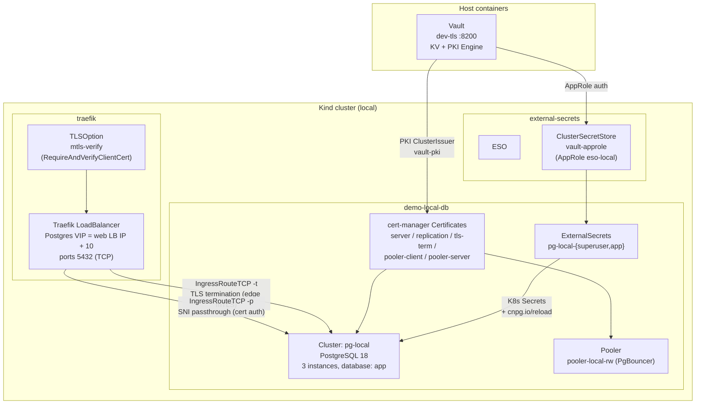

# ESO + Vault Secrets Demo

Demonstrates Vault-backed **static** PostgreSQL credentials, ESO-managed K8s Secrets, hot rotation without restart, CNPG cluster provisioning, and end-to-end mTLS via Traefik IngressRouteTCP — scoped to a single foundational cluster (`pg-local`) with **no tenant, no dynamic credentials**. This is the base secrets story that the [self-service demo](self-service-demo.md) builds on.

## Architecture



### Component Roles

| Component | Role |
|---|---|
| Vault KV (`cnpg/pg-local/`) | Static credentials for `superuser` and `app` |
| Vault PKI (`vault-pki` ClusterIssuer) | Issues all mTLS certs; CA bundle in Secret `vault-pki-bundle` |
| ESO ClusterSecretStore `vault-approle` | Syncs KV secrets to K8s Secrets; AppRole `eso-local` (installed by `scripts/setup.sh`, retained across demo teardown) |
| ExternalSecrets `pg-local-{superuser,app}` | `refreshInterval: 15m`; render `kubernetes.io/basic-auth` Secrets labelled `cnpg.io/reload: "true"` |
| CNPG Cluster `pg-local` | 3-instance PostgreSQL 18, database `app`, superuser access enabled; pinned to tainted **postgres** nodes |
| Pooler `pooler-local-rw` | Single-instance PgBouncer (session mode), mTLS on both client and server sides |
| cert-manager Certificates | `pg-local-server-tls`, `pg-local-replication-tls`, `pg-local-tls-term-server`, `pg-local-pooler-client-tls`, `pg-local-pooler-server-tls` |
| Traefik `TLSOption mtls-verify` | Enforces `RequireAndVerifyClientCert` on the TLS-termination endpoint |
| Traefik IngressRouteTCP (`-t`) | TLS **termination** at edge (mTLS), then plaintext to Postgres → password (scram) auth |
| Traefik IngressRouteTCP (`-p`) | TLS **passthrough** (SNI) straight to Postgres → client-**cert** auth (CN = role) |

The cluster's `pg_hba` enforces this end to end:

```
hostssl replication streaming_replica all cert
hostssl all         cnpg_pooler_pgbouncer all cert
hostssl all         all               all cert          # passthrough (-p): cert auth
host    all         all               all scram-sha-256 # termination (-t): password auth
```

---

## Prerequisites

Base setup must be complete before running the ESO demo. `scripts/setup.sh` builds the Kind cluster
**and the ESO + Vault foundation** the demo depends on — the `cnpg` KV mount, the `eso-local` AppRole,
and the `ClusterSecretStore vault-approle` — but creates **no** `pg-local` cluster, namespace, or KV
seed until this script runs.

```bash
./scripts/setup.sh local          # Kind cluster + Vault + ESO ClusterSecretStore vault-approle
./demo/eso-vault.sh setup local    # seed KV + deploy ESO-backed pg-local cluster (see Runbook below)
```

Unlike the self-service demo, the ESO demo has **no monitoring dependency** — it does not deploy
Grafana, pgAdmin, ArgoCD, or a tenant. `local` is the only supported mode.

Verify Traefik has a LoadBalancer IP (the Postgres VIP is this IP with the last octet **+10**):

```bash
kubectl get svc traefik -n traefik --context kind-k8s-local \
    -o jsonpath='{.status.loadBalancer.ingress[0].ip}'
```

---

## Runbook: Setup

```bash
./demo/eso-vault.sh setup local
```

What it does (in order):

1. **Vault KV seed** — `cnpg/pg-local/{superuser,app}` with random 32-char passwords (username `postgres` / `app`)
2. **Namespace** — creates `demo-local-db`
3. **ExternalSecrets** — applies `pg-local-superuser` and `pg-local-app`, then waits for each to reach `Ready=True`
4. **mTLS certificates** — issues 5 cert-manager Certificates (`server`, `replication`, `tls-term-server`, `pooler-client`, `pooler-server`) via the `vault-pki` ClusterIssuer; waits for each `Ready`
5. **PgBouncer auth secret** — `pg-local-pooler-auth` (required when using custom pooler TLS secrets)
6. **Traefik TLSOption** — applies `mtls-verify` (`RequireAndVerifyClientCert`)
7. **IngressRouteTCP** — applies the TLS-termination (`-t`) and TLS-passthrough (`-p`) routes on the Postgres VIP `:5432`
8. **CNPG Cluster** — applies `pg-local` (3 instances) + `pooler-local-rw`; waits up to **30m** for `condition=Ready`

Setup output includes the endpoints and credential source:

```
✅ ESO demo setup complete!
   Cluster: pg-local  Namespace: demo-local-db
   Credentials managed by Vault at cnpg/pg-local/{superuser,app}
   TLS-termination endpoint: pg-local-demo-local-db-t.<IP>.sslip.io
   TLS-passthrough endpoint:  pg-local-demo-local-db-p.<IP>.sslip.io
```

---

## Runbook: Verify

```bash
./demo/eso-vault.sh verify local superuser
./demo/eso-vault.sh verify local app
```

Reads the current ESO-synced K8s Secret and runs `psql \conninfo` from inside `pg-local-1` against the
`pg-local-rw` service (`superuser` → `postgres` DB, `app` → `app` DB). Confirms the credential ESO
projected from Vault actually authenticates.

---

## Runbook: Rotate Credential

Rotates an ESO-managed static credential (`superuser` or `app`) with **no restart**:

```bash
./demo/eso-vault.sh rotate local app
./demo/eso-vault.sh rotate local superuser
```

1. Patches Vault KV with a new random password
2. Annotates the ExternalSecret (`force-sync=<epoch>`) to force immediate sync
3. Waits for the K8s Secret's `resourceVersion` to change (up to 60s)
4. Verifies the new credential via `psql` from `pg-local-1`

The `cnpg.io/reload: "true"` label on the Secret template triggers CNPG to reload credentials into
PostgreSQL without a restart.

---

## Using the Demo: External Connections

Both connect subcommands **stage the needed cert/key/CA into a temp dir and print a ready-to-run
`psql`** — neither auto-connects. The two endpoints demonstrate the two auth models:

### TLS termination (password auth)

```bash
./demo/eso-vault.sh connect local app
```

Prints a `psql` for the `-t` endpoint (`pg-local-demo-local-db-t.<IP>.sslip.io:5432`). Traefik performs
**edge mTLS** (verifying the client cert against `mtls-verify`), terminates TLS, then connects plaintext
to Postgres, which authenticates by **password** (scram). The staged `pooler-client` cert only satisfies
the Traefik edge — its CN is irrelevant to Postgres here.

### TLS passthrough (mTLS cert auth, no password)

```bash
./demo/eso-vault.sh connect-mtls local app
```

Issues a short-lived **1h** client Certificate (`CN = <role>`, ECDSA P-256) via the `vault-pki`
ClusterIssuer, then prints a `psql` for the `-p` endpoint (`pg-local-demo-local-db-p.<IP>.sslip.io:5432`).
Traefik passes TLS straight through (SNI); Postgres authenticates by **client certificate**
(`hostssl all all all cert`), where the cert CN must equal the role — no password crosses the wire.
The issued cert lives in `demo-local-db`, so `teardown` removes it with the namespace.

---

## Runbook: Teardown

```bash
./demo/eso-vault.sh teardown local
```

Removes (narrow scope):

- `IngressRouteTCP pg-local-tls-term` + `pg-local-tls-passthrough` in `demo-local-db`
- `TLSOption mtls-verify` in `traefik`
- Namespace `demo-local-db` (deletes all CNPG, ESO, cert-manager, and pooler resources within)
- Vault KV paths `cnpg/pg-local/{superuser,app}`

**Not removed** (foundation stays intact — only `scripts/teardown.sh` nukes the whole environment):

- ESO infrastructure — `ClusterSecretStore vault-approle`, the `eso-local` AppRole, and the `cnpg` KV mount (all installed by `scripts/setup.sh`)
- Vault PKI (`vault-pki` ClusterIssuer / `vault-pki-bundle`)

---

## Caveats

- **Static credentials, not dynamic.** This demo issues fixed Vault KV credentials rotated on demand. Just-in-time, TTL-bound logins from the Vault Database Secrets Engine are the [self-service demo](self-service-demo.md)'s differentiator, not this one.
- **`local` mode only.** The script hard-fails on any mode other than `local`.
- **Postgres VIP is derived, not the web LB IP.** The Postgres endpoints live on the Traefik LB IP with the **last octet +10**; the `sslip.io` host uses that dashed octet. Recomputed identically on every subcommand, so `connect`/`connect-mtls` stay correct without re-reading setup state.
- **`connect-mtls` mints a 1h cert per call.** The client cert expires after 1h; re-run `connect-mtls` for a fresh one. It is namespaced to `demo-local-db` and cleaned up on teardown.
- **Requires the ESO foundation.** If `scripts/setup.sh` has not created the `vault-approle` ClusterSecretStore and `cnpg` KV mount, the ExternalSecrets never reach `Ready` and setup aborts at the sync wait.
