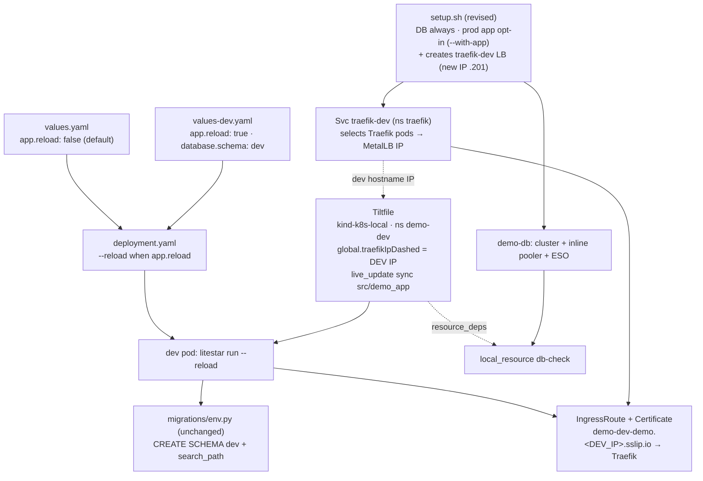

# Phase 3 — Tilt live-dev for `demo-app` in `demo-dev`

## Context

Phase 3 of `docs/plan-litestar-app.md` ("Developer Experience") promises that a
developer can run `tilt up` and get a live-reloading instance of the Litestar
`demo-app` running **in-cluster** in the `demo-dev` namespace, sharing the
already-provisioned `demo-db` CNPG cluster. The three artifacts exist
(`app/Tiltfile`, `app/Dockerfile.dev`, `app/helm/demo-app/values-dev.yaml`) but
the workflow does not actually function.

> **IMPORTANT — branch base.** All files below live **only on the `refactor`
> branch**. `main` (and the current `claude/refine-local-plan-v758vj` branch,
> cut from `main`) contains none of `app/`. Implementation must happen on a
> branch based off `origin/refactor`, and any PR must target `refactor`. The
> user is handling branch setup separately; this document is the refined plan.

### Verified defects (confirmed against `origin/refactor`)

1. **Wrong kube context** — `app/Tiltfile` calls `allow_k8s_contexts('kind-kind')`;
   the real context is `kind-k8s-local`.
2. **No real hot reload** — `Dockerfile.dev`'s `CMD` (`uvicorn … --reload`) is
   *overridden* by the Helm deployment's command. With dev's
   `migration.strategy: startup` the container runs
   `sh -c "litestar database upgrade && litestar run --host 0.0.0.0 --port 8000"` —
   no `--reload`. `live_update` syncs files in, but the server never reloads them.
3. **Stale sync** — `sync('./seed', '/app/seed')` targets a path that doesn't
   exist. Seed lives at `src/demo_app/seed.py`, already covered by the
   `src/demo_app` sync.
4. **No namespace** — `k8s_yaml(helm('./helm/demo-app', …))` deploys to the
   default namespace, not `demo-dev`.
5. **DB deps not deployed / misleading comment** — the Tiltfile comment claims to
   deploy the CNPG cluster/pooler/secrets but only applies three namespace
   manifests. The real DB is provisioned by `app/scripts/setup.sh` (CNPG `demo`
   cluster with the PgBouncer pooler defined inline in `cluster-demo.yaml.tpl`).

### Decisions (confirmed with user)

- **`app/scripts/setup.sh` provisions DB only by default; the prod app install is
  opt-in.** Today setup.sh always runs `helm upgrade --install demo-app -n demo`.
  Change it so the DB (namespaces, ExternalSecrets, ObjectStore, CNPG `demo`
  cluster + inline pooler) is created unconditionally, but the prod Helm install
  runs only when an opt-in flag is passed (`--with-app`, or `INSTALL_APP=1`).
- **A dedicated dev LoadBalancer IP fronts the same Traefik.** setup.sh creates a
  second `LoadBalancer` Service (`traefik-dev`, namespace `traefik`) that selects
  the existing Traefik pods and draws a fresh MetalLB IP from `kind-pool`
  (`172.18.255.200-.250`; Traefik's primary is `.200`). Dev traffic still
  terminates at Traefik, so the chart's IngressRoute + cert-manager TLS keep
  working — only the IP in the hostname differs: dev is served at
  `demo-dev-demo.<DEV_IP_DASHED>.sslip.io`. `teardown.sh` deletes that service.
- **Dev data isolated via a `dev` schema** (not a separate DB). Values-only:
  `migrations/env.py` already does `CreateSchema(schema, if_not_exists=True)` +
  `SET search_path TO <schema>, public` and lands `alembic_version` + tables in
  the non-public schema. The `app` role owns `demo`, so it can create the schema.
- **Dev DB password Secret is handled by the chart itself.** `templates/secret-eso.yaml`
  creates an ExternalSecret named `demo-app` in `.Release.Namespace` from Vault
  `cnpg/demo/app`. Deploying the chart into `demo-dev` provisions it there
  automatically (default `externalSecret.enabled: true`).

**Outcome:** after `setup.sh` (DB-only) the developer exports the dev Traefik IP
and runs `tilt up` → a hot-reloading dev app at
`https://demo-dev-demo.<DEV_IP_DASHED>.sslip.io` and `localhost:8000`, writing to
the `dev` schema, with edits under `src/demo_app/**` reflected in ~1s, no rebuild.

## Dependency shape



## Changes (on a branch off `refactor`)

### 1. `app/helm/demo-app/templates/deployment.yaml` — opt-in `--reload`
Today the container `command` is:
```yaml
{{- if eq .Values.migration.strategy "startup" }}
command: ["sh", "-c", "litestar database upgrade && litestar run --host 0.0.0.0 --port 8000"]
{{- else }}
command: ["litestar", "run", "--host", "0.0.0.0", "--port", "8000"]
{{- end }}
```
Append `--reload` only when `.Values.app.reload`, for **both** branches:
```yaml
{{- $reload := ternary " --reload" "" .Values.app.reload }}
{{- if eq .Values.migration.strategy "startup" }}
command: ["sh", "-c", "litestar database upgrade && litestar run --host 0.0.0.0 --port 8000{{ $reload }}"]
{{- else if .Values.app.reload }}
command: ["litestar", "run", "--host", "0.0.0.0", "--port", "8000", "--reload"]
{{- else }}
command: ["litestar", "run", "--host", "0.0.0.0", "--port", "8000"]
{{- end }}
```
Keep `litestar run` (not the `--factory` uvicorn form `dev.sh` uses) — it already
works in-cluster for prod via `[tool.litestar]` app discovery. Reload restarts only
the ASGI subprocess, not the `sh -c` wrapper, so the startup migration runs once.

### 2. `app/helm/demo-app/values.yaml` — default the flag off
In the existing `app:` block add: `reload: false   # never run the reloader in prod`.

### 3. `app/helm/demo-app/values-dev.yaml` — enable reload + isolate data
```yaml
app:
  debug: true
  logLevel: "DEBUG"
  reload: true        # new
database:
  schema: "dev"       # new — migrations auto-create it
```
Keep existing `replicaCount: 1`, `image`, `migration.strategy: startup`,
`resources`, `tls.hostnamePrefix: demo-dev-demo`. No `database.host`/`migrationHost`
override — dev shares `pooler-demo-rw.demo-db`.

### 4. `app/Tiltfile` — rewrite to actually work
```python
# -*- mode: Starlark -*-
allow_k8s_contexts('kind-k8s-local')

docker_build(
    'demo-app', context='.', dockerfile='Dockerfile.dev',
    live_update=[
        sync('./src/demo_app', '/app/src/demo_app'),
        run('cd /app && uv sync', trigger=['./pyproject.toml', './uv.lock']),
    ],
)

# DB + the traefik-dev LB are owned by scripts/setup.sh. Tilt only creates the
# dev namespace and the dev app.
k8s_yaml('./k8s/namespace-demo-dev.yaml')

k8s_yaml(helm(
    './helm/demo-app',
    name='demo-app', namespace='demo-dev',
    values=['./helm/demo-app/values-dev.yaml'],
    set=['global.traefikIpDashed=' + os.environ['TRAEFIK_IP_DASHED'], 'image.tag=dev'],
))

local_resource(
    'db-check',
    cmd='kubectl get cluster demo -n demo-db >/dev/null 2>&1 '
        '|| { echo "demo-db not found — run app/scripts/setup.sh first"; exit 1; }',
)

k8s_resource('demo-app', port_forwards='8000:8000', resource_deps=['db-check'])
```
Changes vs. today: correct context; drop stale `sync('./seed', …)`; drop the
misleading DB-deps block and the `namespace-demo`/`namespace-demo-db` applies;
deploy into `demo-dev` via `helm(namespace=…)` (Tilt's `helm()` `namespace` arg
both passes `--namespace` and injects the namespace onto objects lacking one);
drop `image.pullPolicy=Always` from the `set` list (Tilt injects an exact image
ref; `Always` only forces needless re-pulls); read `TRAEFIK_IP_DASHED` (now the
**dev** LB IP) from env; add a read-only `db-check` guard wired as `resource_deps`.

### 5. `app/scripts/setup.sh` — DB-only by default, opt-in app, create dev LB
- **Arg/env parsing:** accept `--with-app` (or `INSTALL_APP=1`) → `INSTALL_APP=true`,
  default false.
- **Always (DB):** keep the namespace/ExternalSecret/ObjectStore/CNPG-cluster
  apply + `kubectl wait cluster/demo` exactly as today.
- **Create the dev Traefik LB** by cloning the live Traefik service so the selector
  and ports are exact (jq is provided by `flake.nix` and already used in
  `scripts/`):
  ```bash
  kubectl get svc traefik -n traefik -o json \
    | jq 'del(.status,.spec.clusterIP,.spec.clusterIPs,.spec.loadBalancerIP,
              .metadata.uid,.metadata.resourceVersion,.metadata.creationTimestamp,
              .metadata.annotations)
          | .metadata.name="traefik-dev"
          | .metadata.annotations={"metallb.universe.tf/address-pool":"kind-pool"}' \
    | kubectl apply -f -
  kubectl wait --for=jsonpath='{.status.loadBalancer.ingress[0].ip}' \
    svc/traefik-dev -n traefik --timeout=60s
  DEV_TRAEFIK_IP=$(kubectl get svc traefik-dev -n traefik \
    -o jsonpath='{.status.loadBalancer.ingress[0].ip}')
  DEV_TRAEFIK_IP_DASHED=$(echo "$DEV_TRAEFIK_IP" | tr '.' '-')
  ```
- **Opt-in prod app:** wrap the existing `helm upgrade --install demo-app
  --namespace demo …` (still using the **prod** Traefik IP `.200`) in
  `if [ "$INSTALL_APP" = true ]; then … fi`.
- **Final output:** always print the dev IP and the exact Tilt bootstrap line, e.g.
  `export TRAEFIK_IP_DASHED=$DEV_TRAEFIK_IP_DASHED` plus the dev URL
  `https://demo-dev-demo.$DEV_TRAEFIK_IP_DASHED.sslip.io`; print the prod URL only
  when `INSTALL_APP=true`.

### 6. `app/scripts/teardown.sh` — remove the dev LB
Add `kubectl delete svc traefik-dev -n traefik --ignore-not-found 2>/dev/null || true`
alongside the existing cleanup (keep `helm uninstall demo-app -n demo` so an
opt-in install is still cleaned up).

### 7. `app/README.md` — Tilt usage docs (create file)
Document the workflow below under "Local in-cluster development with Tilt".

## How to use Tilt (the documented workflow)

**One-time prerequisites** (platform — Traefik, cert-manager, ESO, Vault, CNPG
operator — already running in `kind-k8s-local`):
```bash
cd app
./scripts/setup.sh            # DB only: demo-db cluster + inline pooler + ESO + traefik-dev LB
# ./scripts/setup.sh --with-app   # ALSO install the prod app into the `demo` namespace
```
setup.sh prints the dev IP and the exact `export TRAEFIK_IP_DASHED=…` line.

**Start live development**
```bash
cd app
export TRAEFIK_IP_DASHED=$(kubectl get svc -n traefik traefik-dev \
  -o jsonpath='{.status.loadBalancer.ingress[0].ip}' | tr '.' '-')
tilt up                       # Tilt UI at http://localhost:10350
```
Tilt builds the dev image from `Dockerfile.dev`, deploys the chart into `demo-dev`
(reload on, `dev` schema), runs startup migrations, and port-forwards the pod.

**Use it**
- Ingress (via dev LB): `https://demo-dev-demo.<DEV_IP_DASHED>.sslip.io`
- Port-forward: `http://localhost:8000`
- Dashboard/logs: `http://localhost:10350`
- Edit `app/src/demo_app/**` → synced into the pod, uvicorn reloads ~1s (no rebuild).
  `pyproject.toml`/`uv.lock` → in-pod `uv sync`; `Dockerfile.dev` → full rebuild.

**Stop**: `tilt down` (removes the `demo-dev` release; `demo-db`, the `traefik-dev`
LB, and any prod `demo` release are left intact — `app/scripts/teardown.sh` removes
the rest).

## Verification

1. **Render check (no cluster):**
   `helm template demo-app app/helm/demo-app -f app/helm/demo-app/values-dev.yaml --set global.traefikIpDashed=172-18-255-201 -n demo-dev`
   → container command ends with `--reload`; ConfigMap has `DEMO_APP_DB_SCHEMA: "dev"`;
   IngressRoute/Certificate host = `demo-dev-demo.172-18-255-201.sslip.io`. Render
   prod `values.yaml` → command has **no** `--reload`.
2. **`setup.sh` (DB-only):** `demo` cluster `Ready`; `kubectl get svc traefik-dev -n
   traefik` shows a distinct external IP from `traefik`; **no** `demo-app` release in
   `demo`. Re-run with `--with-app` → prod app installed.
3. **`tilt up`** → all resources green; `db-check` passes.
4. **Schema isolation:** exec into a `demo-db` PG pod → `\dn` shows `dev`; `\dt dev.*`
   shows `tasks` + `alembic_version`; `public` untouched by dev.
5. **Hot reload:** open `http://localhost:8000`, edit a string in
   `src/demo_app/templates/index.html`, save; change appears on refresh in ~1–2s, no
   pod restart (watch Tilt logs for uvicorn "Reloading").
6. **Ingress + TLS on the dev IP:**
   `curl -k https://demo-dev-demo.<DEV_IP_DASHED>.sslip.io/health` → `{"status":"healthy"}`.
7. **`teardown.sh`** → `traefik-dev` svc gone, `demo-dev` release gone; primary
   `traefik` svc and (unless torn down) `demo-db` intact.

## Notes / out of scope
- Per project convention (beads), track this as an issue/epic
  (`bd create --type=feature …`) before implementing.
- The standalone `app/k8s/pooler-demo.yaml` is a no-op reference file (pooler is
  inline in `cluster-demo.yaml.tpl`) and `app/k8s/externalsecret-demo-app.yaml`
  targets `demo-db` — both unrelated to these edits; leave them alone.
- The dev LB draws the next free MetalLB IP from `kind-pool`; it is not pinned to a
  fixed octet, so always read it back from the service status (setup.sh does this
  and prints it).
