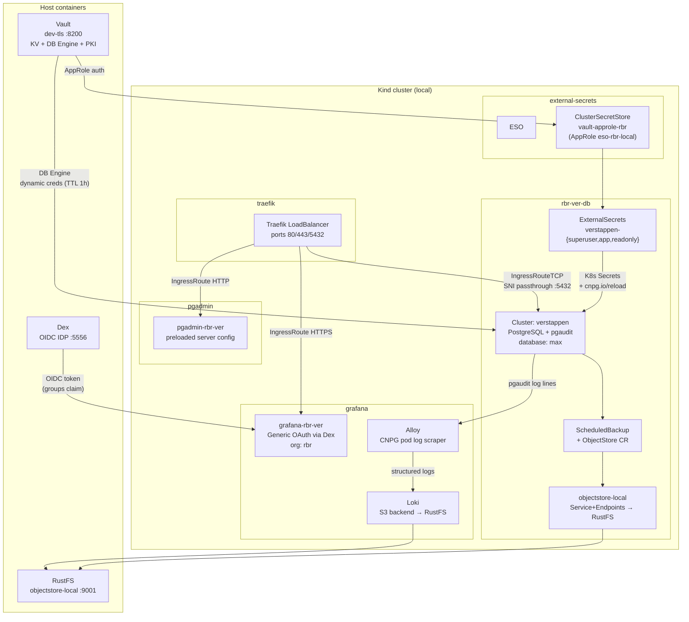

# Self-Service Database Demo

Demonstrates Vault-backed dynamic credentials, ESO-managed static secrets, CNPG cluster provisioning, Traefik TCP passthrough, pgAdmin, and Grafana with Dex OIDC — scoped to a single tenant (`rbr`) and group (`rbr/ver`).

## Architecture



### Component Roles

| Component | Role |
|---|---|
| Vault KV (`cnpg/rbr/ver/`) | Static credentials for superuser, app, readonly |
| Vault DB Engine | Dynamic credentials: `rbr-db-admin` (1h), `rbr-ver-db-admin` (1h), `rbr-ver-db-readonly` (1h) |
| ESO ClusterSecretStore | Syncs KV secrets to K8s Secrets; AppRole scoped to `cnpg/data/rbr/ver/*` |
| CNPG Cluster `verstappen` | 3-replica PostgreSQL 18, database `max`, pgaudit enabled, barman backups |
| `rbr_ver_ddl_owner` | Stable DDL owner role; all objects must be owned by this role |
| `rbr_ver_ddl_admin` | Has `rbr_ver_ddl_owner`; VDE admin/group-admin dynamic users inherit via `IN ROLE` |
| `rbr_ver_vde_admin` | Static VDE admin user for Vault DB Engine connection (non-rotating) |
| Traefik TCP | SNI passthrough on port 5432; sslmode=require enforced end-to-end |
| pgAdmin `pgadmin-rbr-ver` | Preloaded server config; credentials pasted manually from `creds` subcommand |
| Dex | OIDC IDP; `groups` claim populated from `staticPasswords.groups` field |
| `grafana-rbr-ver` | Grafana Operator CR; Generic OAuth; org `rbr` pre-created; `grafana-rbr-ver` Dex client |
| Loki | Single-binary log store; S3 backend on `objectstore-local`; deployed by `monitoring/setup.sh` |
| Alloy | Tails CNPG pod logs via K8s API; extracts pgaudit labels; pushes to Loki |

---

## Prerequisites

Base setup must be complete before running the self-service demo:

```bash
./scripts/setup.sh local          # Kind cluster, Vault, Dex, cert-manager, ESO, Traefik
./monitoring/setup.sh local       # kube-prometheus-stack, Grafana Operator, Loki, Alloy
```

Verify Traefik has a LoadBalancer IP:

```bash
kubectl get svc traefik -n traefik --context kind-k8s-local \
    -o jsonpath='{.status.loadBalancer.ingress[0].ip}'
```

---

## Runbook: Setup

```bash
./demo/self-service-setup.sh setup local
```

What it does (in order):

1. **Traefik upgrade** — adds `postgres` entrypoint on port 5432
2. **Vault policies** — `eso-rbr-ver`, `rbr-db-admin`, `rbr-ver-db-admin`, `rbr-ver-db-readonly`
3. **ESO AppRole** `eso-rbr-local` — role_id/secret_id persisted to `vault/.eso_rbr_role_id/secret_id`; K8s Secret `vault-approle-rbr-creds` in `external-secrets`; `ClusterSecretStore vault-approle-rbr` applied
4. **Vault KV seed** — `cnpg/rbr/ver/{superuser,app,readonly}` with random passwords
5. **Namespaces** — `rbr-ver-db`, `rbr-ver`
6. **ExternalSecrets** — superuser, app, readonly; waits for Ready status
7. **Objectstore wiring** — `objectstore-local` Service+Endpoints in `rbr-ver-db` pointing to RustFS; objectstore Secret
8. **CNPG Cluster** — `verstappen` cluster; waits up to 30m for Ready
9. **Traefik TCP IngressRoute** — SNI passthrough on `verstappen-rbr-ver-db.<IP>.sslip.io:5432`
10. **Stable PostgreSQL roles** — `rbr_ver_ddl_owner`, `rbr_ver_ddl_admin`, `rbr_ver_ddl_reader` with grants
11. **VDE admin role** — `rbr_ver_vde_admin` with CREATEROLE; password in Vault KV `cnpg/rbr/ver/vde-admin`
12. **Vault DB Engine** — config `rbr-ver-max` (sslip.io endpoint, TLS); roles `rbr-db-admin`, `rbr-ver-db-admin`, `rbr-ver-db-readonly`
13. **pgAdmin** — `pgadmin-rbr-ver` Deployment in `pgadmin` namespace; servers.json ConfigMap preloaded; HTTP IngressRoute
14. **Grafana + Dex** — re-renders `dex-config.yaml` with `TRAEFIK_IP_DASHED`; restarts Dex; issues TLS cert; deploys `grafana-rbr-ver` CR with Generic OAuth; applies Prometheus + Loki datasources + pgaudit dashboard; HTTPS IngressRoute; pre-creates `rbr` org via API

Setup output includes the full access summary:

```
✅ Setup complete
   Cluster:     verstappen  Namespace: rbr-ver-db
   External DB: verstappen-rbr-ver-db.<IP>.sslip.io:5432
   sslmode:     require

   pgAdmin:     http://pgadmin-rbr-ver.<IP>.sslip.io
   Email:       admin@example.com
   Password:    <generated>

   Grafana:     https://grafana-rbr-ver.<IP>.sslip.io
   Dex users:   rbr-admin@example.com / rbr-ver-admin@example.com
   (password:   same as dexuser — see DEX_STATIC_PASSWORD_HASH)
```

The Dex default password (`DEX_STATIC_PASSWORD_HASH` in `scripts/common.sh`) is `password`.

---

## Runbook: Verify

```bash
./demo/self-service-setup.sh verify local
```

Connects as superuser via internal cluster DNS and runs `SELECT current_user, version();`.

---

## Using the Demo: pgAdmin

> **Note:** pgAdmin in server mode does not support pre-stored passwords via `PasswordExecCommand`. Credentials must be pasted manually at connect time.

### Workflow

1. Get dynamic credentials:

   ```bash
   ./demo/self-service-setup.sh creds local group-admin
   # or
   ./demo/self-service-setup.sh creds local tenant-admin
   ```

   Output includes `username` and `password` from Vault DB Engine (TTL 1h).

2. Open pgAdmin at `http://pgadmin-rbr-ver.<IP>.sslip.io`

3. Login with credentials printed by `setup` (email + generated password).

4. The server `verstappen (rbr-ver)` is pre-configured. Click **Connect**, paste the Vault username and password.

5. **Before any DDL**, run in the query tool:

   ```sql
   SET ROLE rbr_ver_ddl_owner;
   ```

   This ensures all created objects are owned by the stable role, not the dynamic VDE user. If DDL runs without this, objects become owned by the ephemeral user — dropping the user will fail until objects are reassigned.

6. Credentials expire after 1h. Repeat from step 1 to reconnect.

---

## Using the Demo: Grafana

### Personas

| Email | Dex groups | Grafana org | Role |
|---|---|---|---|
| `rbr-admin@example.com` | `rbr-db-admin`, `rbr-ver-db-admin` | `rbr` | Admin |
| `rbr-ver-admin@example.com` | `rbr-ver-db-admin` | `rbr` | Editor |
| `unrelated@example.com` | (none) | (none) | — |

All use the default password (`password`).

### Login Flow

1. Open `https://grafana-rbr-ver.<IP>.sslip.io`
2. Click **Sign in with Dex**
3. Log in with one of the email/password pairs above
4. Grafana places you in org `rbr` with the mapped role

### Available Dashboards

- **CloudNativePG** — cluster health, replication lag, connection counts
- **pgaudit Audit Logs** — audit event rate + log stream from Loki (active once Alloy is running and pgaudit events are emitted)

### Org Isolation Note

The `rbr` org provides logical isolation within the Grafana instance. **Folder-level isolation** (restricting dashboard access by role within an org) requires **Grafana Enterprise**. This demo uses OSS — all users in org `rbr` see all dashboards in that org.

---

## Runbook: Rotate Credential

Rotates an ESO-managed static credential (app or readonly):

```bash
./demo/self-service-setup.sh rotate local app
./demo/self-service-setup.sh rotate local readonly
```

1. Patches Vault KV with a new random password
2. Annotates the ExternalSecret to force immediate sync
3. Waits for the K8s Secret's `resourceVersion` to change
4. Verifies the new credential via psql from a pod in `rbr-ver` namespace

The `cnpg.io/reload: "true"` label on the Secret template triggers CNPG to reload credentials without a restart.

---

## Runbook: On-Demand Backup

```bash
./demo/self-service-setup.sh backup local
```

Creates a `Backup` CR in `rbr-ver-db` namespace targeting the `verstappen` cluster via the barman-cloud plugin. Backups land in `objectstore-local` (RustFS) under `s3://verstappen-backups/`.

Track progress:

```bash
kubectl get backup -n rbr-ver-db --context kind-k8s-local
```

> Backup covers PostgreSQL data only. K8s Secrets, TLS certificates, and ESO ExternalSecret resources are not included. Document recovery procedures separately.

---

## Runbook: Get Dynamic Credentials

```bash
# Tenant admin (rbr-db-admin role, access to rbr-ver-db-admin too)
./demo/self-service-setup.sh creds local tenant-admin

# Group admin (rbr-ver-db-admin role)
./demo/self-service-setup.sh creds local group-admin

# Readonly
./demo/self-service-setup.sh creds local readonly
```

Output is the raw `vault read database/creds/<role>` output including `username`, `password`, `lease_id`, and `lease_duration`.

All dynamic credentials expire after 1h (max 4h). Connection string:

```
host=verstappen-rbr-ver-db.<IP>.sslip.io
port=5432
dbname=max
sslmode=require
user=<username from vault>
password=<password from vault>
```

---

## Runbook: Teardown

```bash
./demo/self-service-setup.sh teardown local
```

Removes:

- Namespaces `rbr-ver-db` and `rbr-ver` (deletes all resources including CNPG cluster, backups, PVCs)
- `ClusterSecretStore vault-approle-rbr`
- Secret `vault-approle-rbr-creds` in `external-secrets`
- `IngressRouteTCP postgres-rbr-ver` in `traefik`
- pgAdmin Deployment, Service, ConfigMap, Secret, IngressRoute in `pgadmin`
- Grafana CR, datasources, dashboard, TLS cert, OAuth Secret, IngressRoute in `grafana`

**Not removed:**

- Vault VDE config (`database/config/rbr-ver-max`), roles, and policies — retained for post-demo inspection
- Vault KV paths (`cnpg/rbr/ver/`)
- Dex config — Dex is NOT reconfigured; to remove the self-service entries re-run `scripts/dex-setup.sh`

Clean up Vault manually after the demo:

```bash
# Remove VDE config (revokes all outstanding leases)
vault delete database/config/rbr-ver-max

# Remove KV paths
vault kv delete cnpg/rbr/ver/superuser
vault kv delete cnpg/rbr/ver/app
vault kv delete cnpg/rbr/ver/readonly
vault kv delete cnpg/rbr/ver/vde-admin
```

---

## Caveats

- **pgAdmin credentials are manual paste.** The `PasswordExecCommand` hook is disabled in server mode; there is no automatic credential injection. Extending this with an init container that populates `.pgpass` from Vault at pod startup is a valid next step.
- **Grafana org-level isolation only.** Folder permissions that restrict dashboards within an org require Grafana Enterprise. This demo uses OSS.
- **Dynamic credentials expire.** VDE leases are 1h (max 4h). Reconnect in pgAdmin after expiry by getting fresh creds with `creds local group-admin`.
- **Loki datasource unhealthy until monitoring stack runs.** The `GrafanaDatasource` for Loki is applied by `self-service-setup.sh`. It shows as unhealthy until `monitoring/setup.sh` installs Loki in the `grafana` namespace.
- **Dex TLS is self-signed via Vault PKI.** The CA cert is at `dex/tls/ca-chain.pem`. Browsers will warn on the Dex login page unless the CA is trusted.
