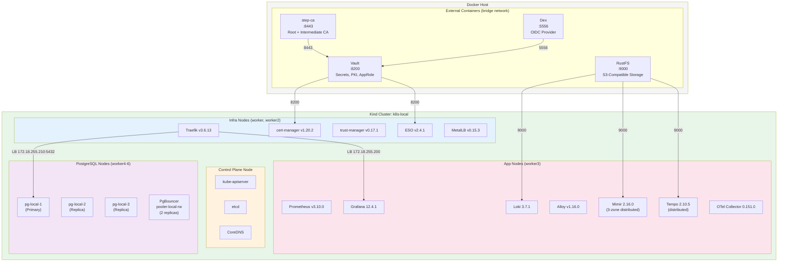
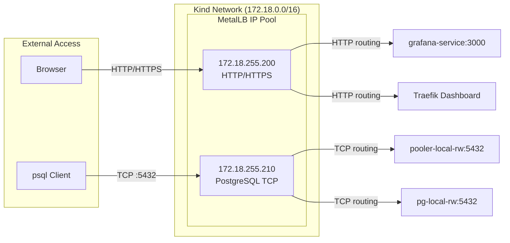
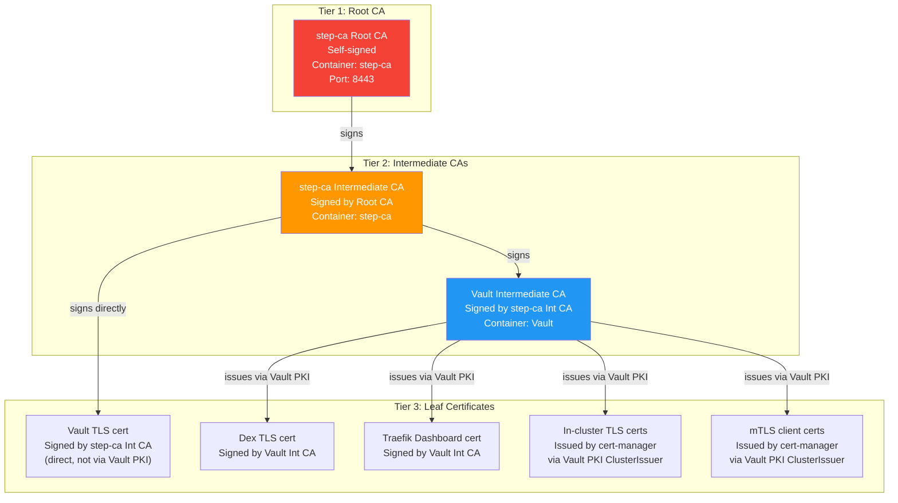
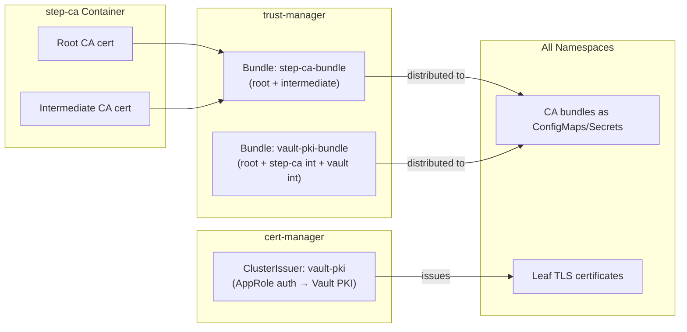
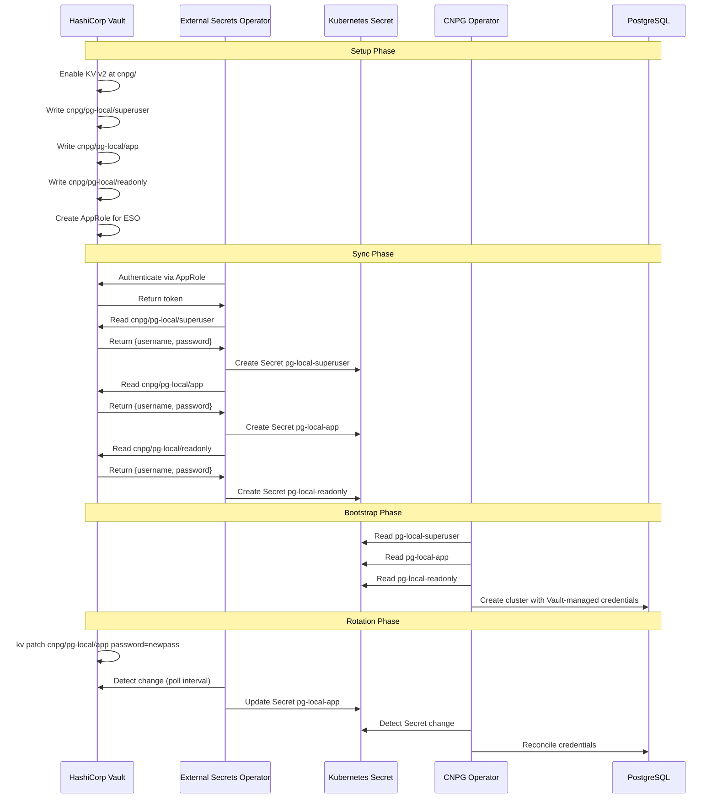
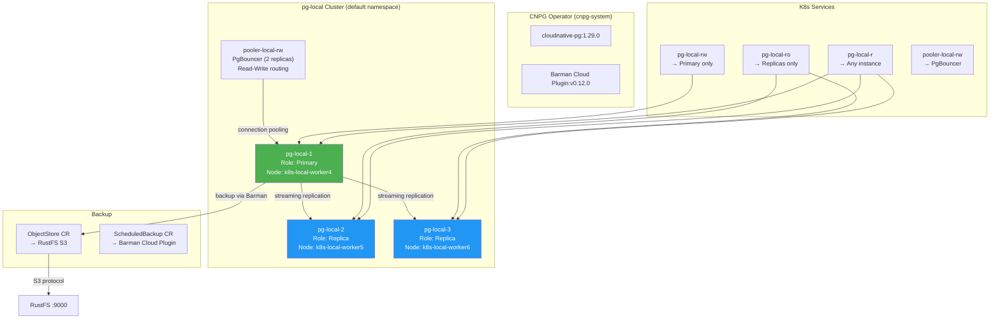
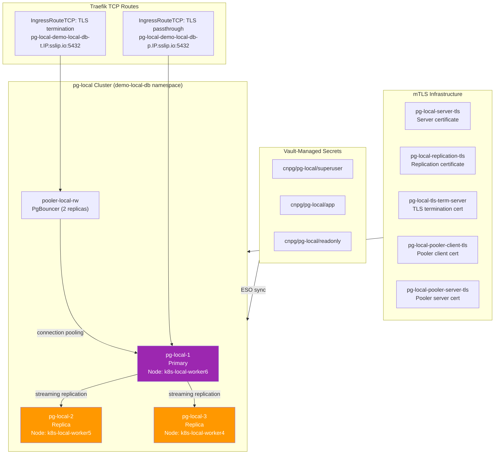
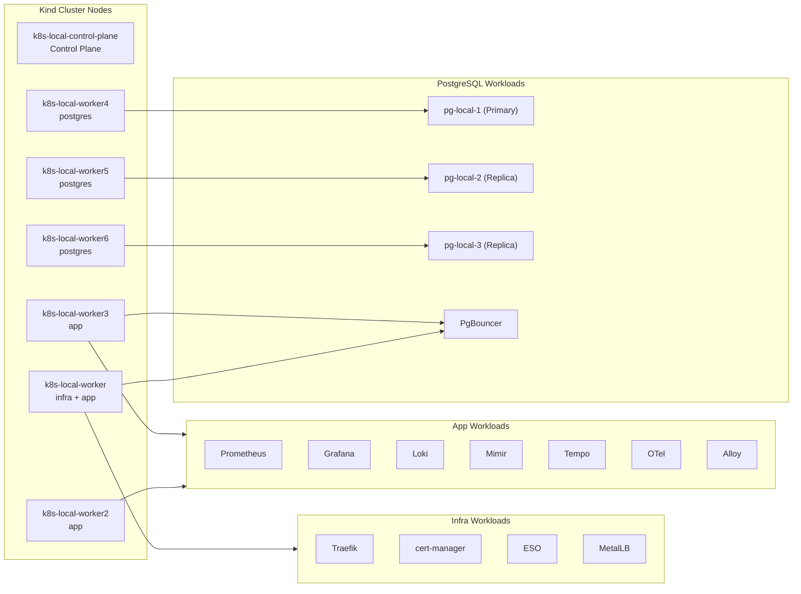
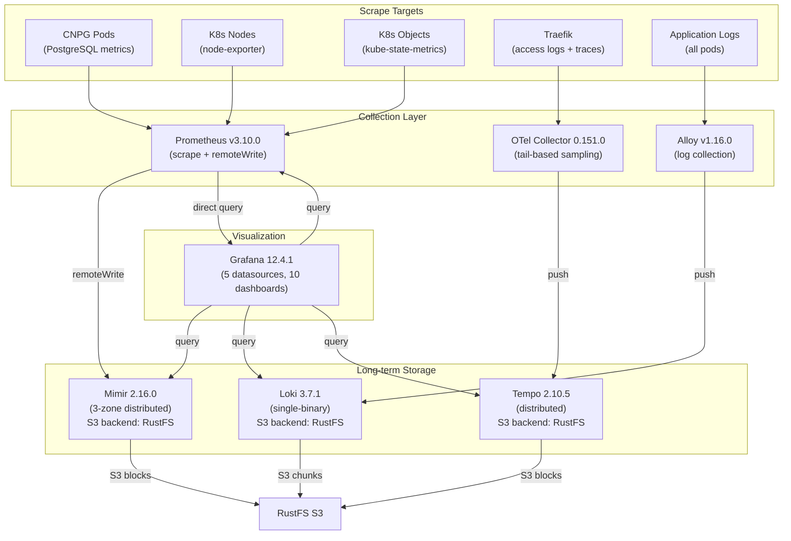
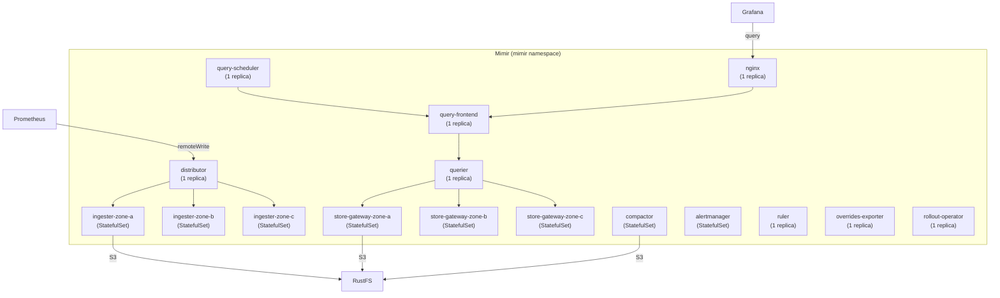

# CNPG Playground — DevOps & Platform Engineer Guide

> **Audience:** DevOps engineers, platform engineers, SREs, and infrastructure specialists who need to understand *how* this environment works at a technical level.

---

## 1. Architecture Deep Dive

### 1.1 Infrastructure Topology



### 1.2 Network Architecture



**Key networking details:**
- MetalLB provides LoadBalancer IPs from the Kind network subnet
- Traefik gets two IPs: `172.18.255.200` (HTTP/HTTPS) and `172.18.255.210` (PostgreSQL TCP)
- External containers (step-ca, Vault, Dex, RustFS) are connected to the Kind network and wired via headless K8s Services/Endpoints
- sslip.io DNS pattern used for TLS certificates (e.g., `grafana.172-18-255-200.sslip.io`)

---

## 2. PKI & Certificate Architecture

### 2.1 3-Tier PKI Hierarchy



### 2.2 Certificate Distribution



**Implementation details:**
- `step-ca-bundle` ConfigMap contains root + intermediate CA certs, distributed by trust-manager to all namespaces
- `vault-pki-bundle` Secret contains the full chain (root + step-ca int + vault int), distributed by trust-manager
- cert-manager uses Vault AppRole authentication (role ID + secret ID stored in K8s Secrets) to issue leaf certificates
- Vault's PKI backend is configured with `vault-pki` role for in-cluster cert issuance (168h TTL for mTLS, longer for server certs)

---

## 3. Secrets Management Architecture

### 3.1 ESO + Vault Flow



### 3.2 ExternalSecret Resources

| ExternalSecret | Vault Path | K8s Secret | Fields |
|---------------|-----------|------------|--------|
| pg-local-superuser | `cnpg/pg-local/superuser` | pg-local-superuser | username, password |
| pg-local-app | `cnpg/pg-local/app` | pg-local-app | username, password |
| pg-local-readonly | `cnpg/pg-local/readonly` | pg-local-readonly | username, password |

**ClusterSecretStore:** `vault-approle` — uses Vault AppRole authentication with role ID and secret ID stored in K8s Secrets.

---

## 4. PostgreSQL Architecture

### 4.1 Cluster Topology



### 4.2 ESO Demo Cluster (demo-local-db namespace)



### 4.3 Node Placement Strategy



**Taints and tolerations:**
- `node-role.kubernetes.io/postgres` nodes have taints that only allow CNPG pods
- `node-role.kubernetes.io/infra` nodes host infrastructure components
- `node-role.kubernetes.io/app` nodes host observability and application workloads

---

## 5. Observability Stack Architecture

### 5.1 Data Flow



### 5.2 Mimir Distributed Architecture



### 5.3 Grafana Datasources

| Datasource | Type | URL | Purpose |
|-----------|------|-----|---------|
| mimir | Prometheus | `http://mimir-nginx.mimir.svc.cluster.local/api/v1/push` | Long-term metrics via Mimir |
| mimir-tempo | Prometheus | `http://mimir-nginx.mimir.svc.cluster.local/api/v1/push` | Tempo metrics via Mimir |
| prometheus | Prometheus | `http://prometheus-operated.prometheus-operator.svc.cluster.local:9090` | Short-term metrics |
| loki | Loki | `http://loki.grafana.svc.cluster.local:3100` | Log aggregation |
| tempo | Tempo | `http://tempo-query-frontend.tempo.svc.cluster.local:3200` | Distributed tracing |

---

## 6. Operational Procedures

### 6.1 Credential Rotation

```bash
# Rotate the 'app' credential
./demo/eso-vault.sh rotate local app

# This:
# 1. Generates a new password in Vault (kv patch cnpg/pg-local/app)
# 2. Forces ESO sync (annotate externalsecret with force-sync timestamp)
# 3. Waits for K8s Secret to update (checks resourceVersion)
# 4. Verifies connectivity with new credentials
```

### 6.2 Verify Connectivity

```bash
# Test psql connectivity for each credential tier
./demo/eso-vault.sh verify local superuser
./demo/eso-vault.sh verify local app
./demo/eso-vault.sh verify local readonly
```

### 6.3 Teardown

```bash
# Remove ESO demo only (keeps infrastructure)
./demo/eso-vault.sh teardown local

# Remove everything (clusters, containers, volumes)
./scripts/teardown.sh
```

### 6.4 Accessing Services

```bash
# Get access URLs
./scripts/info.sh

# Port-forward Grafana (if Traefik not accessible)
kubectl port-forward service/grafana-service 3000:3000 -n grafana

# Port-forward PostgreSQL via PgBouncer
kubectl port-forward service/pooler-local-rw 5432:5432 -n default

# Direct psql via Traefik TCP (ESO demo)
psql "host=172.18.255.210 port=5432 user=app dbname=app sslmode=require"
```

---

## 7. Resource Requirements

### 7.1 Minimum Hardware

| Resource | Minimum | Recommended |
|----------|---------|-------------|
| CPU | 8 cores | 12+ cores |
| RAM | 16 GB | 24+ GB |
| Disk | 40 GB free | 80+ GB free |

### 7.2 Pod Count by Namespace

| Namespace | Pods | Purpose |
|-----------|------|---------|
| cert-manager | 4 | cert-manager, cainjector, webhook, trust-manager |
| cnpg-system | 2 | CNPG operator, Barman Cloud Plugin |
| default | 5 | pg-local (3 instances) + pooler (2 replicas) |
| demo-local-db | 5 | pg-local (3 instances) + pooler (2 replicas) |
| external-secrets | 3 | ESO controller, cert-controller, webhook |
| grafana | 5 | Grafana, operator, Loki, Alloy, canary (×2) |
| metallb-system | 5 | controller + speakers (per node) |
| mimir | 14 | Full distributed stack |
| otel | 1 | OTel Collector |
| prometheus-operator | 9 | Prometheus, operator, kube-state-metrics, node-exporters |
| tempo | 6 | Distributed tracing stack |
| traefik | 1 | Ingress controller |
| **Total** | **~60** | |

### 7.3 Key Configuration Files

| File | Purpose |
|------|---------|
| `k8s/kind-cluster.yaml` | Kind cluster topology (7 nodes, taints, labels) |
| `scripts/common.sh` | Shared variables, versions, helper functions |
| `traefik/values.yaml` | Traefik Helm values |
| `monitoring/mimir/mimir-values.yaml` | Mimir distributed configuration |
| `monitoring/loki/loki-values.yaml` | Loki single-binary configuration |
| `monitoring/tempo/tempo-values.yaml` | Tempo distributed configuration |
| `monitoring/alloy/alloy-config.river` | Alloy log collection pipeline |
| `monitoring/otel-collector/otel-collector-values.yaml` | OTel Collector configuration |
| `demo/yaml/local/pg-local.yaml.tpl` | CNPG cluster definition (basic demo) |
| `demo/yaml/local/pg-local-eso.yaml.tpl` | CNPG cluster definition (ESO demo) |
| `vault/cert-manager/clusterissuer.yaml.tpl` | cert-manager Vault PKI ClusterIssuer |
| `vault/eso/` | ESO ClusterSecretStore templates |