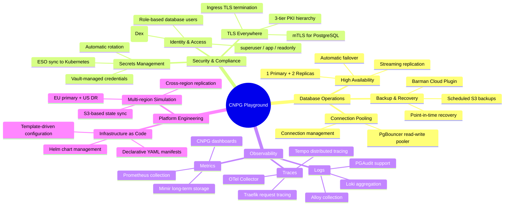
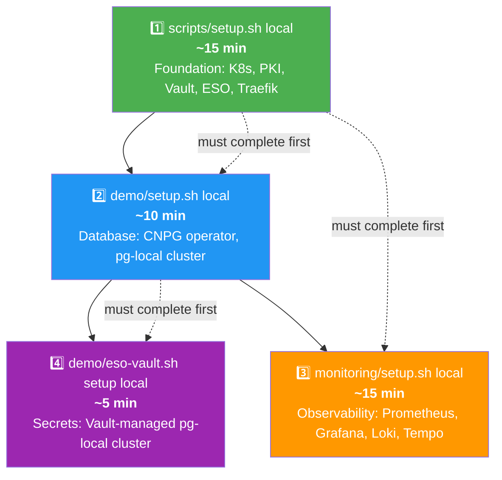

# CNPG Playground — Product Owner & Scrum Master Guide

> **Audience:** Product Owners, Scrum Masters, Project Managers, and stakeholders who need to understand *what* this environment does and *why* it matters, without deep technical details.

---

## 1. What Is CNPG Playground?

CNPG Playground is a **learning and demonstration environment** that runs entirely on a laptop. It simulates a production-grade PostgreSQL platform on Kubernetes, so teams can:

- **Learn** how CloudNativePG (CNPG) works in a realistic setting
- **Demonstrate** database operations, high availability, and disaster recovery
- **Validate** patterns before deploying to real infrastructure
- **Train** new team members without needing cloud resources

Think of it as a **mini data platform** that fits on your machine but mirrors how a real production environment would be configured.

---

## 2. Business Capabilities

---

## 3. What Each Script Delivers (Business View)

### `scripts/setup.sh local` — Platform Foundation

**What it creates:** The entire infrastructure layer that everything else depends on.

| Business Value | Technical Component |
|---------------|-------------------|
| Secure communication | step-ca Root CA + Vault PKI (3-tier certificate hierarchy) |
| Centralized secrets | HashiCorp Vault with AppRole authentication |
| User authentication | Dex OIDC provider (SSO-like experience) |
| Backup storage | RustFS S3-compatible object store |
| Network routing | Traefik ingress + MetalLB load balancer |
| Certificate automation | cert-manager + trust-manager (auto-issuance + distribution) |
| Secret synchronization | External Secrets Operator (Vault → K8s) |

**Time to run:** ~10-15 minutes
**Prerequisites:** Docker, Kind, kubectl, helm

---

### `demo/setup.sh local` — Database Platform

**What it creates:** A running PostgreSQL cluster managed by CNPG.

| Business Value | Technical Component |
|---------------|-------------------|
| Database availability | 3-instance PostgreSQL 18 cluster (1 primary + 2 replicas) |
| Connection management | PgBouncer pooler (2 replicas for read-write) |
| Automated backups | Barman Cloud Plugin → RustFS S3 |
| Monitoring integration | PodMonitor for Prometheus metrics |

**Time to run:** ~5-10 minutes (after setup.sh)

---

### `monitoring/setup.sh local` — Observability Platform

**What it creates:** A complete monitoring, logging, and tracing stack.

| Business Value | Technical Component |
|---------------|-------------------|
| Metric dashboards | Grafana with 10 pre-built dashboards |
| Long-term metrics | Mimir (distributed, 3-zone) with S3 backend |
| Log aggregation | Loki with Alloy collector |
| Distributed tracing | Tempo with OTel Collector (tail-based sampling) |
| Alerting capability | Prometheus + Alertmanager |

**Time to run:** ~10-15 minutes (after setup.sh)

---

### `demo/eso-vault.sh setup local` — Secrets Management Demo

**What it creates:** A second PostgreSQL cluster with enterprise-grade secrets management.

| Business Value | Technical Component |
|---------------|-------------------|
| Vault-managed credentials | 3 credential tiers: superuser, app, readonly |
| Automatic secret sync | External Secrets Operator → K8s Secrets |
| Credential rotation | Update in Vault → ESO sync → CNPG reconciliation |
| Encrypted connections | mTLS with 5 certificate types |
| External database access | Traefik TCP IngressRoute (TLS termination + passthrough) |

**Time to run:** ~5 minutes (after setup.sh + demo/setup.sh)

---

## 4. User Stories

### As a Product Owner

| # | User Story | Priority |
|---|-----------|----------|
| US1 | As a PO, I want to demonstrate database high availability so stakeholders understand our resilience strategy | High |
| US2 | As a PO, I want to show automated backup and recovery so the team validates our DR plan | High |
| US3 | As a PO, I want a visual dashboard showing database health so non-technical stakeholders can monitor status | Medium |
| US4 | As a PO, I want to demonstrate secrets rotation so auditors see our security posture | High |
| US5 | As a PO, I want to simulate multi-region replication so we can plan our geographic distribution | Medium |

### As a Scrum Master

| # | User Story | Priority |
|---|-----------|----------|
| US6 | As a SM, I want a reproducible environment so new team members can onboard quickly | High |
| US7 | As a SM, I want clear teardown procedures so we don't accumulate stale resources | High |
| US8 | As a SM, I want to track setup progress so I can estimate sprint capacity accurately | Medium |
| US9 | As a SM, I want to understand dependencies between scripts so I can plan work in the right order | High |

---

## 5. Setup Order & Dependencies

**Critical path:** `setup.sh` → `demo/setup.sh` → `eso-vault.sh`
**Parallel path:** `monitoring/setup.sh` can run after `setup.sh` independently

---

## 6. Teardown

| Command | What It Removes |
|---------|----------------|
| `demo/eso-vault.sh teardown local` | ESO demo namespace + Vault KV paths (keeps ESO infra) |
| `scripts/teardown.sh` | **Everything** — all Kind clusters, Docker containers, volumes |

---

## 7. Key Metrics & Dashboards

After running all scripts, you have access to:

| URL | Purpose |
|-----|---------|
| `http://grafana.<traefik-ip>.sslip.io` | Grafana dashboards (admin/admin) |
| `https://traefik.<traefik-ip>.sslip.io` | Traefik dashboard |

**Grafana Dashboards available:**

| Dashboard | What It Shows |
|-----------|--------------|
| cloudnativepg-dashboard | PostgreSQL cluster health, replication lag, connections |
| cnpg-custom-pg | Custom PostgreSQL metrics (locks, transactions, cache hit ratio) |
| k8s-resources-cluster | Node CPU, memory, disk usage |
| k8s-views-pods | Pod status, restarts, resource consumption |
| k8s-events | Kubernetes events stream |
| k8s-pod-logs | Pod log viewer |
| node-exporter-full | Detailed node metrics |
| pgaudit-dashboard | PostgreSQL audit log entries |
| traefik-traces | Request tracing through Traefik |

---

## 8. Risk & Limitations

| Risk | Mitigation |
|------|------------|
| **Not for production** — This is a learning environment | Use as reference architecture only |
| **Resource intensive** — 7 K8s nodes + 4 Docker containers + 50+ pods | Requires 16GB+ RAM, 8+ CPU cores |
| **Single-machine** — No real multi-region isolation | Simulates multi-region via separate Kind clusters |
| **Self-signed certificates** — step-ca is the root of trust | For learning; production would use a public CA |
| **No persistence across teardown** — Kind volumes are ephemeral | Backups go to RustFS which persists across restarts |